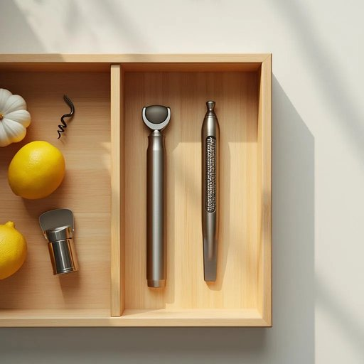

# zester

<h1 style="font-size: 2.5em; font-weight: 300; letter-spacing: 2px; margin: 0; color: #2c3e50;">
/zester*/
</h1>

---

---

## 例句

Could you find the zester in the top drawer beside the garlic press and the corkscrew since I want to grate lemon zest finely to add a fresh, tangy aroma to the cake batter before baking it this afternoon?

*Could(/kʊd/) you(/ju/) find(/faɪnd/) the(/ðə/) zester(/zester*/) in(/ɪn/) the(/ðə/) top(/tɔp/) drawer(/drɔr/) beside(/ˌbiˈsaɪd/) the(/ðə/) garlic(/ˈgɑrlɪk/) press(/prɛs/) and(/ənd/) the(/ðə/) corkscrew(/ˈkɔrkˌskru/) since(/sɪns/) I(/aɪ/) want(/wɔnt/) to(/tɪ/) grate(/greɪt/) lemon(/ˈlɛmən/) zest(/zɛst/) finely(/ˈfaɪnli/) to(/tɪ/) add(/æd/) a(/ə/) fresh,(/frɛʃ,/) tangy(/tangy*/) aroma(/ərˈoʊmə/) to(/tɪ/) the(/ðə/) cake(/keɪk/) batter(/ˈbætər/) before(/ˌbiˈfɔr/) baking(/ˈbeɪkɪŋ/) it(/ɪt/) this(/ðɪs/) afternoon?(/ˌæftərˈnun?/)*

**翻译：** 你能从顶层抽屉里找一下刨丝器吗？它就在压蒜器和开瓶器旁边，我想用它把柠檬皮刨得细细的，给蛋糕糊增添一份清新而酸甜的香气，准备下午烘焙。

---

## 解释

“zester”作为名词在家居生活用品的语境中，指的是一种厨房用具，专门用来刨取柑橘类水果如柠檬、橙子等的表皮薄层，即果皮屑或柑橘皮丝。具体使用场合多见于烹饪或烘焙过程中，当需要添加柑橘香味或调味时，厨师或家庭烹饪者会用zester刨取柑橘表皮的彩色部分，避免白色苦味层。英语学习者需要注意，zester作为名词，通常用于不可数或可数名词情况均可，根据上下文表示工具或刨下的果皮屑，常见搭配有lemon zester（柠檬刨皮器）、use a zester（使用刨皮器）等，表达时多和动词连用，且应区分zester与peeler（削皮器）等工具的不同用途。词源上，zester源自英语zest一词，最早来自法语zeste，意指柑橘类果皮的外层，后引申为带来活力、趣味的含义，代表其在烹饪中赋予食物风味的作用。中文语境中，zester准确的翻译是刨皮器或柑橘刨皮器，强调其专用性和细致性，没有特别的褒贬色彩或特殊文化内涵，是中性且专业的厨房工具名称。

---

<small style="color: #999; font-size: 0.9em;">2025-07-27 09:14:04</small>

