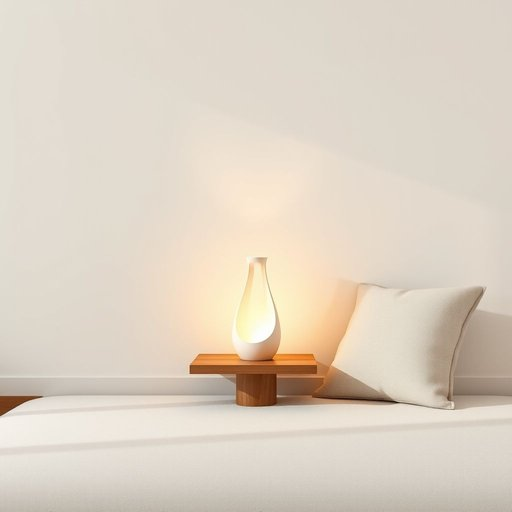

# accessory

<h1 style="font-size: 2.5em; font-weight: 300; letter-spacing: 2px; margin: 0; color: #2c3e50;">
/ækˈsɛsəri/
</h1>

---

---

## 例句

The stylish lamp, alongside the decorative cushions and the vintage clock, served not only as functional items but also as essential accessories that transformed the otherwise plain living room into a warm and inviting space where guests felt immediately at ease.

*The(/ðə/) stylish(/ˈstaɪlɪʃ/) lamp,(/læmp,/) alongside(/əˈlɔŋˈsaɪd/) the(/ðə/) decorative(/ˈdɛkrətɪv/) cushions(/ˈkʊʃənz/) and(/ənd/) the(/ðə/) vintage(/ˈvɪntɪʤ/) clock,(/klɑk,/) served(/sərvd/) not(/nɑt/) only(/ˈoʊnli/) as(/ɛz/) functional(/ˈfəŋkʃənəl/) items(/ˈaɪtəmz/) but(/bət/) also(/ˈɔlsoʊ/) as(/ɛz/) essential(/ɛˈsɛnʃəl/) accessories(/ækˈsɛsəriz/) that(/ðət/) transformed(/trænsˈfɔrmd/) the(/ðə/) otherwise(/ˈəðərˌwaɪz/) plain(/pleɪn/) living(/ˈlɪvɪŋ/) room(/rum/) into(/ˈɪntu/) a(/ə/) warm(/wɔrm/) and(/ənd/) inviting(/ˌɪnˈvaɪtɪŋ/) space(/speɪs/) where(/wɛr/) guests(/gɛsts/) felt(/fɛlt/) immediately(/ˌɪˈmiˌdiətli/) at(/æt/) ease.(/iz./)*

**翻译：** 这款时尚的台灯，与装饰抱枕和复古时钟一同，不仅具有实用功能，更是将原本平淡的客厅转变为一个温馨宜人的空间，让来访的客人能够立刻感到放松和舒适的重要装饰。

---

## 解释

在家居生活用品的语境中，名词“accessory”通常指用于装饰或补充主要家具或生活用品的小物件，如窗帘的挂钩、沙发上的靠垫、灯具的装饰罩等，具体使用场合包括描述家居布置的细节、搭配及美化环境时。英语学习者在使用“accessory”时需注意其为可数名词，常见搭配有“home accessories”（家居用品）、“decorative accessories”（装饰配件）等，且通常与“for”或“to”连用表示附件或配件的归属关系，如“accessories for the living room”。语法上，“accessory”多用于复数形式以表示多种配件，也可单指某一具体配件。该词源自拉丁语“accessorius”，意指“附带的、副的”，引申为附属物或配件。中文中，“accessory”在家居用品语境下准确翻译为“配件”、“附件”或“装饰品”，强调其辅助、补充或装饰作用。该词本身中性，无褒贬含义，但在某些场合可能暗示次要或附属的地位，需根据具体语境灵活理解。整体来看，正确理解和使用“accessory”能帮助学习者准确表达家居中辅助性或装饰性的物品，提升表达的丰富度和精准度。

---

<small style="color: #999; font-size: 0.9em;">2025-07-17 06:22:39</small>

