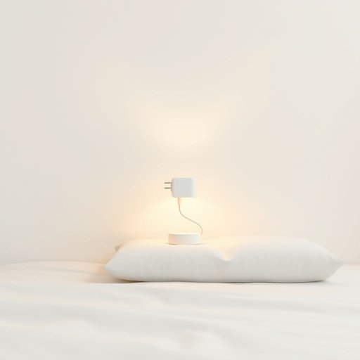

# adapter

<h1 style="font-size: 2.5em; font-weight: 300; letter-spacing: 2px; margin: 0; color: #2c3e50;">
/əˈdæptər/
</h1>

---

---

## 例句

Before you plug in the new bedside lamp, ensure the adapter is compatible, because the voltage and plug shape differ from typical UK sockets, which could otherwise cause a short circuit damaging the appliance or tripping the fuse.

*Before(/ˌbiˈfɔr/) you(/ju/) plug(/pləg/) in(/ɪn/) the(/ðə/) new(/nu/) bedside(/ˈbɛdˌsaɪd/) lamp,(/læmp,/) ensure(/ɪnˈʃʊr/) the(/ðə/) adapter(/əˈdæptər/) is(/ɪz/) compatible,(/kəmˈpætəbəl,/) because(/bɪˈkəz/) the(/ðə/) voltage(/ˈvoʊltɪʤ/) and(/ənd/) plug(/pləg/) shape(/ʃeɪp/) differ(/ˈdɪfər/) from(/frəm/) typical(/ˈtɪpɪkəl/) UK(/uk*/) sockets,(/ˈsɑkəts,/) which(/wɪʧ/) could(/kʊd/) otherwise(/ˈəðərˌwaɪz/) cause(/kɔz/) a(/ə/) short(/ʃɔrt/) circuit(/ˈsərkət/) damaging(/ˈdæmɪʤɪŋ/) the(/ðə/) appliance(/əˈplaɪəns/) or(/ər/) tripping(/ˈtrɪpɪŋ/) the(/ðə/) fuse.(/fjuz./)*

**翻译：** 在插入新的床头灯之前，请确保适配器兼容，因为电压和插头形状与典型的英国插座不同，否则可能导致短路，损坏电器或使保险丝跳闸。

---

## 解释

英语单词adapter在家居生活用品领域作为名词，通常指用于连接或转换电器设备以适应不同插座、电压、电源或接口的装置。例如，旅行时常用的电源适配器power adapter可以让不同国家的电器兼容当地的插座和电源，普通家用也可能使用适配器将一个插头转换为另一种类型，或将电压调整到适用范围。英语学习者在使用adapter时需注意其不可数用法较少，一般为可数名词，常见搭配包括power adapter、plug adapter、travel adapter等，且通常与具体设备或电源相关联。此外，adapter后可接介词短语表示用途，如adapter for laptop表示笔记本电脑用适配器，其词形变化为复数adapters。词源上，adapter来自拉丁语动词adaptare，意为使适合，通过法语进入英语，用后缀-er构成表示执行适配动作的人或物，隐含实用功能转变的意义。在中文语境中，adapter准确对应适配器或转换器，侧重于适应、转换功能，强调技术工具属性，通常无褒贬含义，属于中性词汇，文化上与现代电子生活密切相关，反映出全球化背景下不同技术标准的兼容需求。

---

<small style="color: #999; font-size: 0.9em;">2025-07-17 06:22:39</small>

