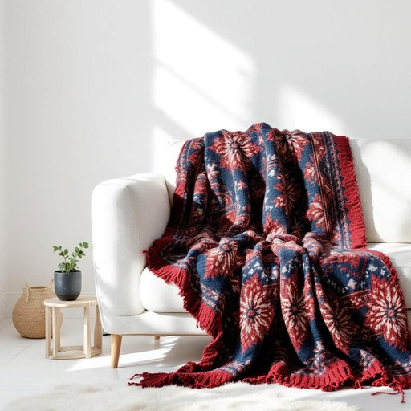

# afghan

<h1 style="font-size: 2.5em; font-weight: 300; letter-spacing: 2px; margin: 0; color: #2c3e50;">
/ˈæfˌgæn/
</h1>

---

---

## 例句

Could you please help me find the hand-knitted afghan that Grandma made last Christmas, the one with the intricate patterns in deep reds and blues, which we usually drape over the sofa to keep the living room warm during those chilly winter evenings?

*Could(/kʊd/) you(/ju/) please(/pliz/) help(/hɛlp/) me(/mi/) find(/faɪnd/) the(/ðə/) hand-knitted(/hand-knitted*/) afghan(/ˈæfˌgæn/) that(/ðət/) Grandma(/ˈgrændmɑ/) made(/meɪd/) last(/læst/) Christmas,(/ˈkrɪsməs,/) the(/ðə/) one(/wən/) with(/wɪθ/) the(/ðə/) intricate(/ˈɪntrəkət/) patterns(/ˈpætərnz/) in(/ɪn/) deep(/dip/) reds(/rɛdz/) and(/ənd/) blues,(/bluz,/) which(/wɪʧ/) we(/wi/) usually(/ˈjuʒəwəli/) drape(/dreɪp/) over(/ˈoʊvər/) the(/ðə/) sofa(/ˈsoʊfə/) to(/tɪ/) keep(/kip/) the(/ðə/) living(/ˈlɪvɪŋ/) room(/rum/) warm(/wɔrm/) during(/ˈdʊrɪŋ/) those(/ðoʊz/) chilly(/ˈʧɪli/) winter(/ˈwɪntər/) evenings?(/ˈivnɪŋz?/)*

**翻译：** 您能帮我找到奶奶去年圣诞节手工编织的那条阿富汗毛毯吗？那条饰有深红与蓝色复杂图案的毛毯，我们通常披在沙发上，用来在寒冷的冬日晚间为客厅增添温暖。

---

## 解释

“afghan”作为名词在家居生活用品的语境中，通常指一种手工编织或钩织的毯子或盖毯，通常使用毛线制成，具有装饰性和保暖性，常用来覆盖沙发、椅子或床铺，营造温馨舒适的居家氛围。学习者在使用“afghan”时应注意其作为可数名词，常见搭配有“an afghan”、“a colorful afghan”或“a handmade afghan blanket”等，通常用冠词修饰，且在复数形式中为“afghans”。此外，需区分“afghan”作为名词与形容词时的用法，前者指毯子，后者多指“阿富汗的”。词源上，“afghan”一词源自阿富汗（Afghanistan）国家名，最初指与阿富汗人相关的事物，后来演变为指一种起源于该地区或风格相仿的手工编织盖毯。这种用法在英语文化中没有褒贬色彩，更多体现手工艺品的文化传承和家居装饰功能。在中文语境中，“afghan”准确翻译为“手工编织盖毯”或“钩针毯”，强调其作为家居用品的温暖与装饰价值，而非单纯地域概念，避免误解为“阿富汗人”或“阿富汗的”形容词含义。

---

<small style="color: #999; font-size: 0.9em;">2025-07-17 06:22:39</small>

