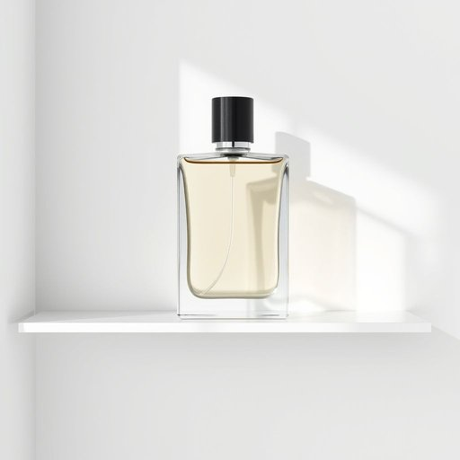

# aftershave

<h1 style="font-size: 2.5em; font-weight: 300; letter-spacing: 2px; margin: 0; color: #2c3e50;">
/ˌæftərˈʃeɪv/
</h1>

---

---

## 例句

The discovery of the ancient manuscript, hidden deep within the library's archives, sparked a wave of scholarly excitement that transcended disciplines and inspired a series of interdisciplinary conferences aimed at exploring its historical and cultural significance.

*The(/ðə/) discovery(/ˌdɪˈskəvri/) of(/əv/) the(/ðə/) ancient(/ˈeɪnʧənt/) manuscript,(/ˈmænjəˌskrɪpt,/) hidden(/ˈhɪdən/) deep(/dip/) within(/wɪˈθɪn/) the(/ðə/) library's(/ˈlaɪbrɛˌriz/) archives,(/ˈɑrˌkaɪvz,/) sparked(/spɑrkt/) a(/ə/) wave(/weɪv/) of(/əv/) scholarly(/ˈskɑlərli/) excitement(/ɪkˈsaɪtmənt/) that(/ðət/) transcended(/trænˈsɛndɪd/) disciplines(/ˈdɪsəplənz/) and(/ənd/) inspired(/ˌɪnˈspaɪərd/) a(/ə/) series(/ˈsɪriz/) of(/əv/) interdisciplinary(/ˌɪntərˈdɪsəpləˌnɛri/) conferences(/ˈkɑnfərənsəz/) aimed(/eɪmd/) at(/æt/) exploring(/ɪkˈsplɔrɪŋ/) its(/ɪts/) historical(/hɪˈstɔrɪkəl/) and(/ənd/) cultural(/ˈkəlʧərəl/) significance.(/sɪgˈnɪfɪkəns./)*

**翻译：** 一份隐藏在图书馆档案深处的古代手稿的发现激发了一股跨越学科的学术热潮并促成了一系列旨在探讨其历史与文化意义的跨学科会议。

---

## 解释

英语单词“aftershave”作为名词，指的是剃须后使用的一种护肤品或香水，通常含有杀菌成分和芳香剂，用于舒缓剃须后皮肤，防止感染和减少刺激，常见于家居生活用品中。具体使用场合多为男性剃须之后，在浴室或卧室中使用，帮助护理面部皮肤，提升清爽感。在英语学习中，aftershave通常作不可数名词使用，但有时也可以用作可数名词，指具体品牌或类型的产品，如“a bottle of aftershave”。常见的搭配有“apply aftershave”（涂抹须后水），“aftershave lotion/splash”（须后水/须后喷雾），学习者应注意此词多用单数形式表示物品总体或整体类型。词源方面，aftershave由“after”（之后）和“shave”（剃须）组成，字面即“剃须之后使用的东西”，起源于19世纪末至20世纪初，伴随现代剃须用品的普及而出现。中文语境中，“aftershave”通常被准确翻译为“须后水”或“须后乳”，强调其剃须后的特殊用途和功效；有时也译作“剃须后用的香水”或“剃须后护理液”。此词无明显褒贬色彩，属于中性名词，但在文化层面上，须后水往往与男性日常护理和形象塑造相关，体现一定的生活品质与自我关注意识。

---

<small style="color: #999; font-size: 0.9em;">2025-07-17 06:22:39</small>

