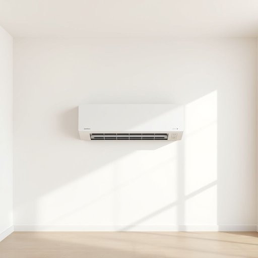

# air-conditioner

<h1 style="font-size: 2.5em; font-weight: 300; letter-spacing: 2px; margin: 0; color: #2c3e50;">
/air-conditioner*/
</h1>

---

---

## 例句

Although the intricate mechanism, designed with precision and complexity beyond initial expectations, occasionally fails to operate smoothly, the engineers remain confident that their constant adjustments will ultimately resolve the issue.

*Although(/ˌɔlˈðoʊ/) the(/ðə/) intricate(/ˈɪntrəkət/) mechanism,(/ˈmɛkəˌnɪzəm,/) designed(/dɪˈzaɪnd/) with(/wɪθ/) precision(/priˈsɪʒən/) and(/ənd/) complexity(/kəmˈplɛksɪti/) beyond(/bɪɔnd/) initial(/ˌɪˈnɪʃəl/) expectations,(/ˌɛkspɛkˈteɪʃənz,/) occasionally(/ɔˈkeɪʒənəˌli/) fails(/feɪlz/) to(/tɪ/) operate(/ˈɔpərˌeɪt/) smoothly,(/sˈmuðli,/) the(/ðə/) engineers(/ˈɛnʤəˈnɪrz/) remain(/rɪˈmeɪn/) confident(/ˈkɑnfədənt/) that(/ðət/) their(/ðɛr/) constant(/ˈkɑnstənt/) adjustments(/əˈʤəstmənts/) will(/wɪl/) ultimately(/ˈəltəmətli/) resolve(/riˈzɑlv/) the(/ðə/) issue.(/ˈɪʃu./)*

**翻译：** 尽管这台结构复杂、设计精密且远超最初预期的机械偶尔运行不畅，工程师们仍然坚信，通过不断调整，最终能够解决这一问题。

---

## 解释

英语单词“air-conditioner”作为名词在家居生活用品场景中指的是一种用于调节室内空气温度和湿度的电器设备，通常用于制冷，有时也具备加热和除湿功能，常见于家庭、办公室等室内环境中以改善生活和工作舒适度。具体使用场合多为描述家中或公共场所的空调设备，例如“The air-conditioner in my room is not working”（我房间里的空调坏了）。英语学习者在使用“air-conditioner”时应注意其为复合名词，通常以单数形式出现，但当表示多个设备时需用复数“air-conditioners”，并且常与动词“turn on/off”，“install”，“repair”，“use”等搭配，如“turn on the air-conditioner”。此外，形容词如“central air-conditioner”（中央空调）和“portable air-conditioner”（便携式空调）是常见搭配。在词源方面，“air-conditioner”由“air”（空气）和“conditioner”（调节器）组成，起源于20世纪初，随着现代制冷技术的发展而出现，这一词汇反映了对空气环境调节设备的描述，体现了工业化带来的生活方式变化。中文中准确翻译为“空调”或“空调机”，强调其调节空气温度和湿度的功能，理解时应区分为制冷设备而非仅限自然风扇或通风设备；在使用时无特殊褒贬含义，属于中性词汇，但在某些文化背景中，空调可能隐含节能与环境保护的争议。总体而言，“air-conditioner”是描述现代家居舒适设备的标准术语，使用时需结合具体语境和搭配以表达准确。

---

<small style="color: #999; font-size: 0.9em;">2025-07-17 06:22:39</small>

