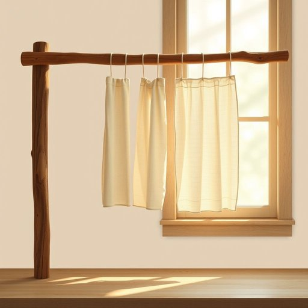

# airer

<h1 style="font-size: 2.5em; font-weight: 300; letter-spacing: 2px; margin: 0; color: #2c3e50;">
/airer*/
</h1>

---

---

## 例句

After washing the delicate linens this morning, I carefully hung them on the old wooden airer by the kitchen window, which, despite its simple design, efficiently catches every gentle breeze that filters through, ensuring the clothes dry naturally without any harsh creases.

*After(/ˈæftər/) washing(/ˈwɑʃɪŋ/) the(/ðə/) delicate(/ˈdɛləkət/) linens(/ˈlɪnənz/) this(/ðɪs/) morning,(/ˈmɔrnɪŋ,/) I(/aɪ/) carefully(/ˈkɛrfəli/) hung(/həŋ/) them(/ðɛm/) on(/ɔn/) the(/ðə/) old(/oʊld/) wooden(/ˈwʊdən/) airer(/airer*/) by(/baɪ/) the(/ðə/) kitchen(/ˈkɪʧən/) window,(/ˈwɪndoʊ,/) which,(/wɪʧ,/) despite(/dɪˈspaɪt/) its(/ɪts/) simple(/ˈsɪmpəl/) design,(/dɪˈzaɪn,/) efficiently(/ɪˈfɪʃəntli/) catches(/ˈkæʧɪz/) every(/ˈɛvəri/) gentle(/ˈʤɛnəl/) breeze(/briz/) that(/ðət/) filters(/ˈfɪltərz/) through,(/θru,/) ensuring(/ɪnˈʃʊrɪŋ/) the(/ðə/) clothes(/kloʊðz/) dry(/draɪ/) naturally(/ˈnæʧərəli/) without(/wɪˈθaʊt/) any(/ˈɛni/) harsh(/hɑrʃ/) creases.(/ˈkrisɪz./)*

**翻译：** 今天早晨洗完细致的亚麻布后，我小心翼翼地将它们挂在厨房窗边那架旧木质晾衣架上。尽管设计朴素，它却能高效捕捉每一缕轻柔的微风，使衣物自然晾干，不留任何硬挺的折痕。

---

## 解释

英语单词“airer”作为名词，在家居生活用品场景中通常指用于晾干衣物的架子或装置，常见于室内或室外，帮助衣物通过通风加速干燥。具体使用场合一般是在描述晾晒衣服的行为或相关设备时，例如“clothes airer”即指晾衣架。在语法上，“airer”作为可数名词，单数形态是airer，复数形态为airers，常与形容词搭配如“folding airer”（折叠式晾衣架）、“wooden airer”（木制晾衣架）等，英语学习者需注意其作为物品名词使用时的数的变化和搭配习惯。词源上，“airer”源自动词“air”的派生名词形式，即进行“通风、晾晒”的装置；“air”一词起源于拉丁语“aer”，意指空气，因此“airer”本质上指利用空气进行干燥的工具。在中文语境中，“airer”准确翻译为“晾衣架”或“晾晒架”，强调其功能为促进衣物通风干燥，无特殊褒贬或文化负面含义，属于中性家居用品词汇，常见于家庭日常生活描述。

---

<small style="color: #999; font-size: 0.9em;">2025-07-17 06:22:39</small>

