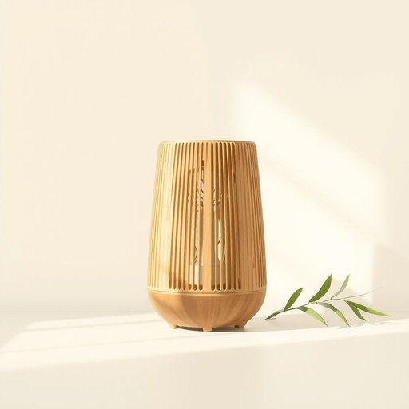

# airfilter

<h1 style="font-size: 2.5em; font-weight: 300; letter-spacing: 2px; margin: 0; color: #2c3e50;">
/airfilter*/
</h1>

---

---

## 例句

The airfilter's maintenance is crucial because neglecting this component can lead to significant reductions in the ventilation system's overall efficiency and compromise indoor air quality.

*The(/ðə/) airfilter's(/airfilter's*/) maintenance(/ˈmeɪntənəns/) is(/ɪz/) crucial(/ˈkruʃəl/) because(/bɪˈkəz/) neglecting(/nɪˈglɛktɪŋ/) this(/ðɪs/) component(/kəmˈpoʊnənt/) can(/kən/) lead(/lɛd/) to(/tɪ/) significant(/sɪgˈnɪfɪkənt/) reductions(/rɪˈdəkʃənz/) in(/ɪn/) the(/ðə/) ventilation(/ˌvɛntɪˈleɪʃən/) system's(/ˈsɪstəmz/) overall(/ˈoʊvərˌɔl/) efficiency(/ɪˈfɪʃənsi/) and(/ənd/) compromise(/ˈkɑmprəˌmaɪz/) indoor(/ˈɪnˌdɔr/) air(/ɛr/) quality.(/kˈwɑləti./)*

**翻译：** 空气滤清器的维护至关重要，因疏忽该部件可能导致通风系统整体效率显著下降，并影响室内空气质量。

---

## 解释

英语单词“airfilter”在家居生活用品语境中作为名词，通常指空气净化装置中的过滤元件，主要作用是滤除空气中的灰尘、花粉、细菌及其他微小颗粒，以改善室内空气质量。具体使用场合多见于空调、空气净化器、吸尘器等家电设备中，用户选购或更换此部件时常会提及该词。英语学习者使用“airfilter”时应注意其拼写，通常写作“air filter”为两词，作为名词短语使用，复数形式为“air filters”，且在句中一般作为具体物品使用，常见搭配有“replace the air filter”（更换空气滤清器）、“clean the air filter”（清洁空气滤清器）、“high-efficiency air filter”（高效空气滤清器）等。此外，词语的构成来源于“air”（空气）与“filter”（过滤器）两个英语单词的组合，直观表达了其功能属性，起源背景与现代室内空气质量需求及空气净化技术发展密切相关。在中文语境中，“airfilter”准确翻译为“空气滤清器”或“空气过滤器”，强调其净化空气、阻挡有害颗粒的功能，无褒贬含义，属于中性词汇，文化内涵主要关联现代健康生活对空气质量的关注，因此在使用时应结合具体家居电器设备或空气净化场景理解。

---

<small style="color: #999; font-size: 0.9em;">2025-07-17 06:22:39</small>

