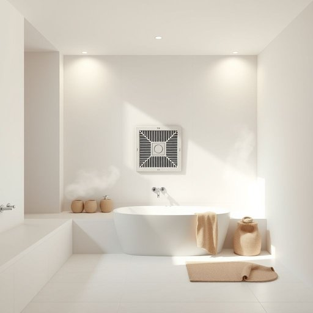

# airflow

<h1 style="font-size: 2.5em; font-weight: 300; letter-spacing: 2px; margin: 0; color: #2c3e50;">
/ˈɛrfloʊ/
</h1>

---

---

## 例句

To prevent mould from developing in the bathroom, it is crucial that the extractor fan maintains a steady airflow throughout the room, especially after hot showers, since stagnant, humid air can easily get trapped in corners and behind tiles where ventilation is poor.

*To(/tɪ/) prevent(/prɪˈvɛnt/) mould(/moʊld/) from(/frəm/) developing(/dɪˈvɛləpɪŋ/) in(/ɪn/) the(/ðə/) bathroom,(/ˈbæθˌrum,/) it(/ɪt/) is(/ɪz/) crucial(/ˈkruʃəl/) that(/ðət/) the(/ðə/) extractor(/extractor*/) fan(/fæn/) maintains(/meɪnˈteɪnz/) a(/ə/) steady(/ˈstɛdi/) airflow(/ˈɛrfloʊ/) throughout(/θruaʊt/) the(/ðə/) room,(/rum,/) especially(/əˈspɛʃəli/) after(/ˈæftər/) hot(/hɑt/) showers,(/ʃaʊərz,/) since(/sɪns/) stagnant,(/ˈstægnənt,/) humid(/ˈjumɪd/) air(/ɛr/) can(/kən/) easily(/ˈizəli/) get(/gɪt/) trapped(/træpt/) in(/ɪn/) corners(/ˈkɔrnərz/) and(/ənd/) behind(/bɪˈhaɪnd/) tiles(/taɪlz/) where(/wɛr/) ventilation(/ˌvɛntɪˈleɪʃən/) is(/ɪz/) poor.(/pur./)*

**翻译：** 为了防止浴室内霉菌滋生，排风扇必须确保整个房间内空气流通顺畅，尤其是在热水淋浴后，因为停滞的潮湿空气容易积聚在通风不良的角落和瓷砖背后。

---

## 解释

“airflow”作为名词在家居生活用品的语境中，主要指空气在室内空间、家具或电器内部的流动情况，如空调、风扇、空气净化器等设备中空气流通的过程和方向。使用场合通常涉及通风系统设计、空气循环效果评价或产品性能描述，比如“good airflow”（良好的气流）常用来形容通风效果佳，有助于空气更新和湿度调节。英语学习者在使用“airflow”时需注意它是不可数名词，不用复数形式，且常与形容词如“efficient”“adequate”“optimal”搭配，构成固定表达。此外，常见结构包括“airflow rate”（气流速率）、“improve airflow”（改善气流）等。词源方面，“airflow”由“air”（空气）和“flow”（流动）复合而成，直观表达空气流动的概念，属于合成词，源自工业和工程领域的专业术语，因此在日常家居应用中更偏技术和功能描述。中文语境中“airflow”准确翻译为“气流”或“空气流动”，强调空气在空间或设备内的动态流通状态，没有褒贬色彩，属于中性词汇，主要体现产品或环境的通风性能和空气质量状况，反映的是物理现象和功能属性，没有特殊文化内涵或情感负载。

---

<small style="color: #999; font-size: 0.9em;">2025-07-17 06:22:39</small>

