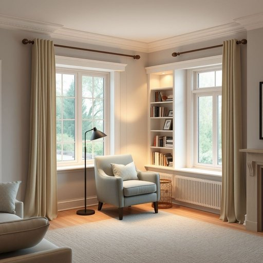

# alcove

<h1 style="font-size: 2.5em; font-weight: 300; letter-spacing: 2px; margin: 0; color: #2c3e50;">
/ˈælˌkoʊv/
</h1>

---

---

## 例句

In the living room, the transformation of the alcove beside the bay window into a reading nook centers around the armchair, the lamp, and the bookshelf designed for unique dimensions.

*In(/ɪn/) the(/ðə/) living(/ˈlɪvɪŋ/) room,(/rum,/) the(/ðə/) transformation(/ˌtrænsfərˈmeɪʃən/) of(/əv/) the(/ðə/) alcove(/ˈælˌkoʊv/) beside(/ˌbiˈsaɪd/) the(/ðə/) bay(/beɪ/) window(/ˈwɪndoʊ/) into(/ˈɪntu/) a(/ə/) reading(/ˈrɛdɪŋ/) nook(/nʊk/) centers(/ˈsɛnərz/) around(/əraʊnd/) the(/ðə/) armchair,(/ˈɑrmˌʧɛr,/) the(/ðə/) lamp,(/læmp,/) and(/ənd/) the(/ðə/) bookshelf(/ˈbʊkˌʃɛlf/) designed(/dɪˈzaɪnd/) for(/fər/) unique(/juˈnik/) dimensions.(/dɪˈmɛnʃənz./)*

**翻译：** 客厅中，转角飘窗旁的壁龛被改造成一个阅读角，核心由那把扶手椅、一盏台灯及为独特尺寸量身设计的书架组成。

---

## 解释

英语单词“alcove”在家居生活用品的语境中作为名词，指的是墙壁内凹或突出形成的小空间或凹室，通常用来安置家具、书架、床铺或装饰品，常见于客厅、卧室或书房等场所。具体使用场合一般是描述房间结构中的特定区域，如“a reading alcove”（阅读角落）或“a bed alcove”（床的凹室），它突出的是这个空间的半封闭性和私密性。英语学习者使用“alcove”时需要注意其为可数名词，常用搭配有“a cozy alcove”（舒适的小隔间）、“a recessed alcove”（嵌入式凹室）以及动词搭配如“nestle in an alcove”（依偎在凹室里）等，表达时也可引申为某种特别安静或温馨的小空间。语法上它通常作主语、宾语或表语，前面常用不定冠词“an”或定冠词“the”修饰。词源方面，“alcove”源自阿拉伯语“al-qubba”，意为圆顶或拱顶，经过法语传入英语，最初指带拱顶的墙壁凹处，体现了其建筑结构特征。中文语境下，“alcove”可准确翻译为“（墙壁的）凹室”或“小隔间”，根据具体情况也可译作“壁龛”或“壁凹”，但不宜与“大房间”或“开放区域”混淆。该词在英文中通常中性无褒贬色彩，但因其常指较为私密、温馨的空间，具有一定的情感温暖和舒适氛围，适合描述富有生活情调的家居环境，没有特殊文化或褒贬内涵。

---

<small style="color: #999; font-size: 0.9em;">2025-07-17 06:22:39</small>

