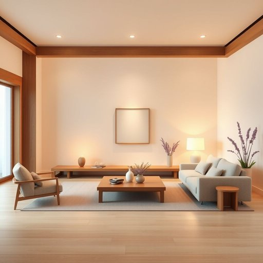

# ambiance

<h1 style="font-size: 2.5em; font-weight: 300; letter-spacing: 2px; margin: 0; color: #2c3e50;">
/ˈæmbiəns/
</h1>

---

---

## 例句

The soft, warm lighting combined with the subtle scent of lavender candles really enhances the ambiance of the living room, creating a cozy and inviting atmosphere that makes you want to relax and unwind after a long day.

*The(/ðə/) soft,(/sɔft,/) warm(/wɔrm/) lighting(/ˈlaɪtɪŋ/) combined(/kəmˈbaɪnd/) with(/wɪθ/) the(/ðə/) subtle(/ˈsətəl/) scent(/sɛnt/) of(/əv/) lavender(/ˈlævəndər/) candles(/ˈkændəlz/) really(/ˈrɪli/) enhances(/ɛnˈhænsɪz/) the(/ðə/) ambiance(/ˈæmbiəns/) of(/əv/) the(/ðə/) living(/ˈlɪvɪŋ/) room,(/rum,/) creating(/kriˈeɪtɪŋ/) a(/ə/) cozy(/ˈkoʊzi/) and(/ənd/) inviting(/ˌɪnˈvaɪtɪŋ/) atmosphere(/ˈætməsˌfɪr/) that(/ðət/) makes(/meɪks/) you(/ju/) want(/wɔnt/) to(/tɪ/) relax(/rɪˈlæks/) and(/ənd/) unwind(/ənˈwaɪnd/) after(/ˈæftər/) a(/ə/) long(/lɔŋ/) day.(/deɪ./)*

**翻译：** 柔和温暖的灯光与淡淡的熏衣草蜡烛香气相融合，极大地提升了客厅的氛围，营造出一个温馨宜人的环境，让人一整天劳累之后都忍不住想放松身心，尽享宁静。

---

## 解释

单词“ambiance”作为名词，在家居生活用品的英语语境中通常指居住空间或环境所营造出的整体氛围或感觉，如灯光、色彩、陈设等共同构成的舒适度和情调，常用于描述室内设计、装饰风格及空间带来的情绪体验。英语学习者在使用“ambiance”时应注意它为不可数名词，一般不加复数形式，常见搭配有“create an ambiance”（营造氛围）、“warm ambiance”（温馨氛围）、“relaxing ambiance”（放松的氛围）等，前面多用形容词修饰来具体化环境特质。此词源自法语，源自拉丁语“ambire”，意为“环绕、包围”，强调环境整体包围人的感觉，带有较为正式、优雅的色彩，较多出现在文艺或设计领域。中文中可译为“氛围”或“环境气氛”，尤其强调情感色彩和空间感受，而不仅是物理环境，适用于评价居家用品如何影响居住者的心情和体验，通常带有中性或褒义含义，体现舒适、温馨、雅致等积极感受，但少见贬义或负面色彩。

---

<small style="color: #999; font-size: 0.9em;">2025-07-17 06:22:39</small>

