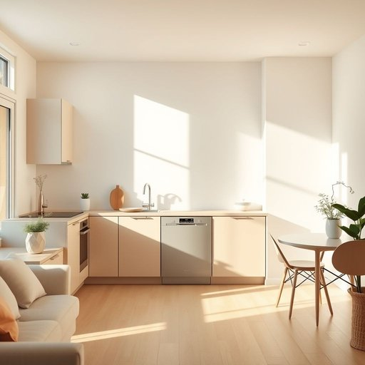

# amenity

<h1 style="font-size: 2.5em; font-weight: 300; letter-spacing: 2px; margin: 0; color: #2c3e50;">
/əˈmɛnəti/
</h1>

---

---

## 例句

Although the flat was a bit smaller than we expected, the landlord assured us that the newly installed amenity, which includes a state-of-the-art dishwasher and a built-in coffee maker, would significantly enhance our daily comfort and convenience.

*Although(/ˌɔlˈðoʊ/) the(/ðə/) flat(/flæt/) was(/wɑz/) a(/ə/) bit(/bɪt/) smaller(/sˈmɔlər/) than(/ðən/) we(/wi/) expected,(/ɪkˈspɛktɪd,/) the(/ðə/) landlord(/ˈlænˌdlɔrd/) assured(/əˈʃʊrd/) us(/ˈjuˈɛs/) that(/ðət/) the(/ðə/) newly(/ˈnuli/) installed(/ˌɪnˈstɔld/) amenity,(/əˈmɛnəti,/) which(/wɪʧ/) includes(/ˌɪnˈkludz/) a(/ə/) state-of-the-art(/ˌsteɪtəvðɪˈɑrt/) dishwasher(/ˈdɪʃˌwɑʃər/) and(/ənd/) a(/ə/) built-in(/ˈbɪlˌtɪn/) coffee(/ˈkɔfi/) maker,(/ˈmeɪkər,/) would(/wʊd/) significantly(/sɪgˈnɪfɪkəntli/) enhance(/ɛnˈhæns/) our(/ɑr/) daily(/ˈdeɪli/) comfort(/ˈkəmfərt/) and(/ənd/) convenience.(/kənˈvinjəns./)*

**翻译：** 虽然这套公寓比我们预期的稍小一些，房东向我们保证，新安装的设施——包括一台先进的洗碗机和内置咖啡机——将大大提升我们的日常舒适度和便利性。

---

## 解释

“amenity”作为名词在家居生活用品的语境中，通常指的是提升生活舒适度和便利性的设施或设备，例如空调、热水器、健身房、游泳池等公共或私人住宅中提供的便利设施。具体使用场合多见于描述居住环境的广告、租赁合同、物业介绍或购房指南中，如“The apartment offers modern amenities including a fully equipped kitchen and high-speed internet”（该公寓提供现代化设施，包括设备齐全的厨房和高速网络）。英语学习者在使用“amenity”时需要注意它通常为可数名词复数形式“amenities”，且常与形容词如“modern”, “basic”, “luxury”等搭配使用，表达设施的不同档次或类型。此外，“amenity”经常与介词“with”或“including”连用以说明设施内容，如“rooms with amenities”或“amenities including a gym”。该词源于拉丁语“amoenus”，意为“宜人、愉快”，原指环境的舒适性，后引申为带来便利和舒适的设备或服务。在中文语境中，“amenity”准确翻译为“便利设施”、“生活设施”或“配套设施”，强调其提升居住质量和生活便捷性的作用，通常属于中性词汇，无明显褒贬色彩，但有时高档住宅会强调“luxury amenities”以体现品质与身份的象征，带有一定的文化内涵。在实际应用中，理解“amenity”应结合具体环境，既可指物质设备，也可泛指提升生活质量的各种便利因素。

---

<small style="color: #999; font-size: 0.9em;">2025-07-17 06:22:39</small>

