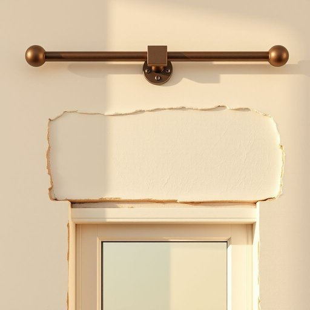

# anchor

<h1 style="font-size: 2.5em; font-weight: 300; letter-spacing: 2px; margin: 0; color: #2c3e50;">
/ˈæŋkər/
</h1>

---

---

## 例句

Before we rearrange the living room curtains, could you please check if the anchor for the curtain rod, which you carefully secured into the wall last weekend, is still holding firm, especially since the damp weather has made some of the plaster loose around the windowsill?

*Before(/ˌbiˈfɔr/) we(/wi/) rearrange(/riəreɪnʤ/) the(/ðə/) living(/ˈlɪvɪŋ/) room(/rum/) curtains,(/ˈkərtənz,/) could(/kʊd/) you(/ju/) please(/pliz/) check(/ʧɛk/) if(/ɪf/) the(/ðə/) anchor(/ˈæŋkər/) for(/fər/) the(/ðə/) curtain(/ˈkərtən/) rod,(/rɑd,/) which(/wɪʧ/) you(/ju/) carefully(/ˈkɛrfəli/) secured(/sɪˈkjʊrd/) into(/ˈɪntu/) the(/ðə/) wall(/wɔl/) last(/læst/) weekend,(/ˈwiˌkɪnd,/) is(/ɪz/) still(/stɪl/) holding(/ˈhoʊldɪŋ/) firm,(/fərm,/) especially(/əˈspɛʃəli/) since(/sɪns/) the(/ðə/) damp(/dæmp/) weather(/ˈwɛðər/) has(/həz/) made(/meɪd/) some(/səm/) of(/əv/) the(/ðə/) plaster(/ˈplæstər/) loose(/lus/) around(/əraʊnd/) the(/ðə/) windowsill?(/windowsill*?/)*

**翻译：** 在我们重新整理客厅窗帘之前，能否请您检查一下您上周末认真固定在墙上的窗帘杆锚固件是否仍然牢固，尤其是在潮湿天气导致窗台周围的一些灰泥变松的情况下？

---

## 解释

英语单词“anchor”在家居生活用品的语境中作为名词，通常指用于固定或支撑某物的物件，比如墙面上用来固定画框、挂钩或其他装饰品的“锚固件”或“墙锚”，这类小型配件常见于DIY装修或挂置物品时。具体使用场合多见于家装、家具安装和收纳整理中，如“wall anchor”（墙锚）帮助螺丝更稳固地固定在石膏板或其他脆弱墙面。英语学习者使用“anchor”作名词时需注意其基本复数形式anchors，以及常见搭配如“anchor bolt”（锚栓）、“anchor point”（固定点）、“plastic anchor”（塑料墙锚）等；此外，作为名词它可以指物理上的固定装置，也可引申为“支撑点”或“依靠”，在搭配中常与位置、稳定、固定等词汇连用。词源上，“anchor”起源于中古英语，来源于拉丁语“anchorāre”，继承自希腊语“ánkura”，原指船用的锚，用于船只停泊固定，后来意义扩展到各类固定、支撑装置。中文语境中，“anchor”作为家居用品，准确翻译常为“锚固件”、“墙锚”或“固定件”，需根据具体产品和功能确认；该词本身无褒贬或特殊文化色彩，仅表示功能性工具，更多体现稳定、安全和依托的含义，符合其在物理固定上的实用属性。

---

<small style="color: #999; font-size: 0.9em;">2025-07-17 06:22:39</small>

