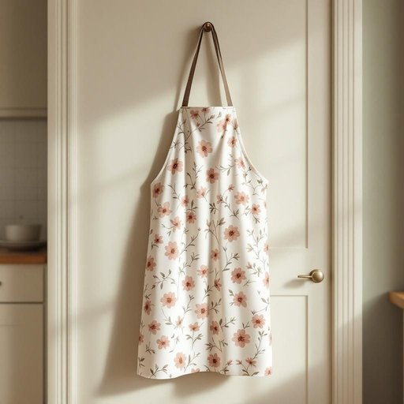

# apron

<h1 style="font-size: 2.5em; font-weight: 300; letter-spacing: 2px; margin: 0; color: #2c3e50;">
/ˈeɪprən/
</h1>

---

---

## 例句

Could you please hand me the apron that has the floral pattern and the adjustable neck strap hanging by the kitchen door, as I’m about to start preparing the Sunday roast and want to make sure I don’t get any gravy stains on my best jumper?

*Could(/kʊd/) you(/ju/) please(/pliz/) hand(/hænd/) me(/mi/) the(/ðə/) apron(/ˈeɪprən/) that(/ðət/) has(/həz/) the(/ðə/) floral(/ˈflɔrəl/) pattern(/ˈpætərn/) and(/ənd/) the(/ðə/) adjustable(/əˈʤəstəbəl/) neck(/nɛk/) strap(/stræp/) hanging(/ˈhæŋɪŋ/) by(/baɪ/) the(/ðə/) kitchen(/ˈkɪʧən/) door,(/dɔr,/) as(/ɛz/) I’m(/i’m*/) about(/əˈbaʊt/) to(/tɪ/) start(/stɑrt/) preparing(/pərˈpɛrɪŋ/) the(/ðə/) Sunday(/ˈsənˌdi/) roast(/roʊst/) and(/ənd/) want(/wɔnt/) to(/tɪ/) make(/meɪk/) sure(/ʃʊr/) I(/aɪ/) don’t(/don’t*/) get(/gɪt/) any(/ˈɛni/) gravy(/ˈgreɪvi/) stains(/steɪnz/) on(/ɔn/) my(/maɪ/) best(/bɛst/) jumper?(/ˈʤəmpər?/)*

**翻译：** 请把挂在厨房门口那条带花卉图案、带可调节脖带的围裙递给我，我正准备开始做周日烤肉，想确保我的最好毛衣不会沾上肉汁。

---

## 解释

英语单词“apron”作为名词在家居生活用品的语境中主要指围裙，即覆盖在前胸和腹部，用以保护衣物免受烹饪、清洁或其他家务劳动时污渍和油渍污染的布制品。这种围裙通常在厨房烹饪、家庭清洁或园艺等场合使用，常见的表达如“wear an apron”（戴围裙）和“tie the apron strings”（绑围裙带）。语法上，“apron”作为可数名词，单复数形式为“aprons”，在使用时应注意其与动词的单复数一致，并常与动词“wear”（穿戴）、“put on”（穿上）或“take off”（脱下）搭配。该词源自中古英语“napron”，来自古法语“naperon”，意为“小布”，最早指小块布料，后来特指用以保护衣服的布。中文语境中，“apron”准确翻译为“围裙”，是厨房及家务常用的生活用品，通常无褒贬色彩，为中性词，具有保护性和实用性的文化内涵，更多体现的是家庭劳动和烹饪场景的亲切与实用。

---

<small style="color: #999; font-size: 0.9em;">2025-07-17 06:22:39</small>

