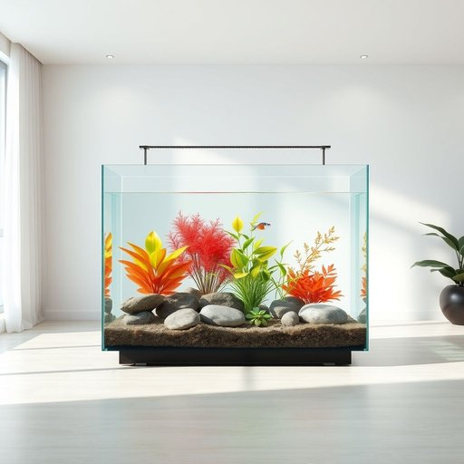

# aquarium

<h1 style="font-size: 2.5em; font-weight: 300; letter-spacing: 2px; margin: 0; color: #2c3e50;">
/əkˈwɛriəm/
</h1>

---

---

## 例句

I’ve been thinking that the new aquarium, which we bought last weekend and carefully set up with a state-of-the-art filtration system and colorful aquatic plants, would not only brighten up the living room but also provide a calming focal point after a long day at work.

*I’ve(/i’ve*/) been(/bɪn/) thinking(/ˈθɪŋkɪŋ/) that(/ðət/) the(/ðə/) new(/nu/) aquarium,(/əkˈwɛriəm,/) which(/wɪʧ/) we(/wi/) bought(/bɔt/) last(/læst/) weekend(/ˈwiˌkɪnd/) and(/ənd/) carefully(/ˈkɛrfəli/) set(/sɛt/) up(/əp/) with(/wɪθ/) a(/ə/) state-of-the-art(/ˌsteɪtəvðɪˈɑrt/) filtration(/fɪlˈtreɪʃən/) system(/ˈsɪstəm/) and(/ənd/) colorful(/ˈkələrfəl/) aquatic(/əkˈwɑtɪk/) plants,(/plænts,/) would(/wʊd/) not(/nɑt/) only(/ˈoʊnli/) brighten(/ˈbraɪtən/) up(/əp/) the(/ðə/) living(/ˈlɪvɪŋ/) room(/rum/) but(/bət/) also(/ˈɔlsoʊ/) provide(/prəˈvaɪd/) a(/ə/) calming(/ˈkɑmɪŋ/) focal(/ˈfoʊkəl/) point(/pɔɪnt/) after(/ˈæftər/) a(/ə/) long(/lɔŋ/) day(/deɪ/) at(/æt/) work.(/wərk./)*

**翻译：** 我一直在想，我们上周末购买并精心安装了配备先进过滤系统和色彩斑斓水生植物的新水族箱，不仅能够点亮客厅，还能在忙碌一天后成为一个宁静的焦点。

---

## 解释

英语单词“aquarium”作为名词，在家居生活用品的语境中通常指一种用来饲养和观赏水生动物及植物的透明容器，常见于家庭、办公室或公共场所，如客厅或餐厅，用来装饰环境并提供观赏乐趣。使用时，英语学习者应注意“aquarium”可数，复数形式为“aquariums”或“aquaria”，且常与动词“keep”或“have”搭配，如“keep an aquarium”，“have aquariums at home”；此外，常见表达还有“fish aquarium”或“home aquarium”等，强调具体用途或地点。这个词源自拉丁语“aquarius”，意为“水的”或“与水相关的”，与拉丁词根“aqua（水）”有关，最早用于描述装有水和水生生物的容器。中文语境中，“aquarium”通常翻译为“水族箱”，强调其作为容器和养殖展示装置的功能，无褒贬色彩，文化上象征着自然美和生活情趣，适合作为室内装饰或养鱼爱好者的用品。

---

<small style="color: #999; font-size: 0.9em;">2025-07-17 06:22:39</small>

