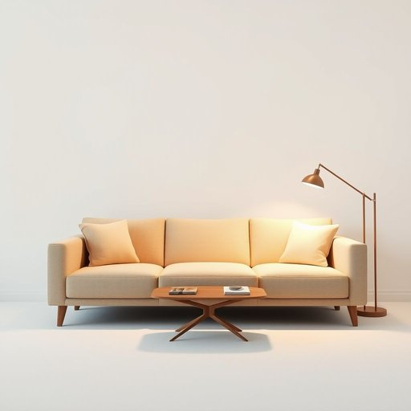

# arm

<h1 style="font-size: 2.5em; font-weight: 300; letter-spacing: 2px; margin: 0; color: #2c3e50;">
/ɑrm/
</h1>

---

---

## 例句

Could you please help me adjust the lamp on the arm of the sofa, which has recently become loose and wobbly, making it difficult to read comfortably in the living room during the evenings?

*Could(/kʊd/) you(/ju/) please(/pliz/) help(/hɛlp/) me(/mi/) adjust(/əˈʤəst/) the(/ðə/) lamp(/læmp/) on(/ɔn/) the(/ðə/) arm(/ɑrm/) of(/əv/) the(/ðə/) sofa,(/ˈsoʊfə,/) which(/wɪʧ/) has(/həz/) recently(/ˈrisəntli/) become(/bɪˈkəm/) loose(/lus/) and(/ənd/) wobbly,(/ˈwɑbəli,/) making(/ˈmeɪkɪŋ/) it(/ɪt/) difficult(/ˈdɪfəkəlt/) to(/tɪ/) read(/rɛd/) comfortably(/ˈkəmfərtəbli/) in(/ɪn/) the(/ðə/) living(/ˈlɪvɪŋ/) room(/rum/) during(/ˈdʊrɪŋ/) the(/ðə/) evenings?(/ˈivnɪŋz?/)*

**翻译：** 您能帮我调整一下沙发扶手上的台灯吗？最近它变得松动摇晃，导致晚上在客厅阅读时感到不便。

---

## 解释

英语单词“arm”在家居生活用品的语境中作为名词，通常指家具如椅子、沙发或扶手椅的“扶手”。具体使用场合多出现在描述家具结构、使用舒适度或设计风格时，例如“The arm of the sofa is padded”（沙发的扶手有衬垫）。英语学习者在使用“arm”表达家具扶手时，需注意它既可以单数形式指单侧扶手，也可以用复数“arms”指两侧扶手，且常见搭配有“armrest”（扶手垫）、“armchair”（扶手椅）等。此外，“arm”作为家具部位的词义，与其表示人体的“手臂”含义紧密相关，二者在语法上均为可数名词，且在具体语境中需根据上下文判断具体含义。词源方面，“arm”源自古英语“earm”，源于原始日耳曼语，最初指人体的“臂”，因其形状和功能被引申至家具的扶手部分，体现了语言的形象化转义。在中文语境中，“arm”译为“扶手”时极为准确，明确指出家具侧部用于手部支撑的结构，没有贬义或特殊文化内涵，但在描述家具时，该词强调的是实用性和舒适性，是家居环境中常用且中性的描述词汇。

---

<small style="color: #999; font-size: 0.9em;">2025-07-17 06:22:39</small>

