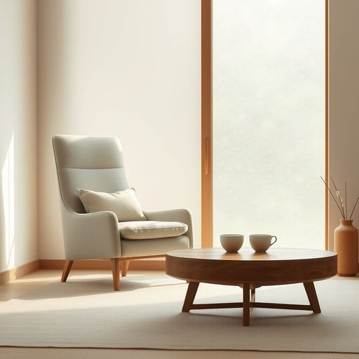

# armchair

<h1 style="font-size: 2.5em; font-weight: 300; letter-spacing: 2px; margin: 0; color: #2c3e50;">
/ˈɑrmˌʧɛr/
</h1>

---

---

## 例句

After a long day of tidying up the living room and rearranging the bookshelves, I finally sank into the armchair by the window, whose plush cushions and high backrest provided the perfect combination of comfort and support, allowing me to relax completely while sipping my tea and watching the rain trickle down the glass.

*After(/ˈæftər/) a(/ə/) long(/lɔŋ/) day(/deɪ/) of(/əv/) tidying(/tidying*/) up(/əp/) the(/ðə/) living(/ˈlɪvɪŋ/) room(/rum/) and(/ənd/) rearranging(/ˌriərˈeɪnʤɪŋ/) the(/ðə/) bookshelves,(/ˈbʊkˌʃɛlvz,/) I(/aɪ/) finally(/ˈfaɪnəli/) sank(/sæŋk/) into(/ˈɪntu/) the(/ðə/) armchair(/ˈɑrmˌʧɛr/) by(/baɪ/) the(/ðə/) window,(/ˈwɪndoʊ,/) whose(/huz/) plush(/pləʃ/) cushions(/ˈkʊʃənz/) and(/ənd/) high(/haɪ/) backrest(/ˈbæˌkrɛst/) provided(/prəˈvaɪdɪd/) the(/ðə/) perfect(/ˈpərˌfɪkt/) combination(/ˌkɑmbəˈneɪʃən/) of(/əv/) comfort(/ˈkəmfərt/) and(/ənd/) support,(/səˈpɔrt,/) allowing(/əˈlaʊɪŋ/) me(/mi/) to(/tɪ/) relax(/rɪˈlæks/) completely(/kəmˈplitli/) while(/waɪl/) sipping(/ˈsɪpɪŋ/) my(/maɪ/) tea(/ti/) and(/ənd/) watching(/ˈwɑʧɪŋ/) the(/ðə/) rain(/reɪn/) trickle(/ˈtrɪkəl/) down(/daʊn/) the(/ðə/) glass.(/glæs./)*

**翻译：** 经过一整天整理客厅和重新摆放书架，我终于坐进了窗边的扶手椅。那扶手椅拥有柔软的坐垫和高靠背，完美地结合了舒适与支撑，让我一边品茶一边看着雨水顺着窗玻璃缓缓流淌，得以彻底放松。

---

## 解释

英语单词“armchair”作为名词，主要指带有扶手的单人沙发椅，常见于家居生活的客厅、卧室或书房等场所，用来提供舒适的坐具。使用时，“armchair”通常与表示家具、舒适、休闲等语境相关，常见搭配包括“armchair comfort”（扶手椅的舒适感）、“armchair traveler”（字面指坐在扶手椅上旅行的人，隐喻通过阅读或想象进行旅行）等。语法上，“armchair”作为可数名词，单复数形式分别为“armchair”和“armchairs”，可与冠词、不定冠词连用，如“an armchair”，也可用作定语，如“armchair designer”（泛指没有实际经验、仅凭想象或理论指挥的人）。词源方面，该词来源于“arm”（扶手）与“chair”（椅子）的组合，最早用于区分带扶手的单人椅与无扶手的椅子，主要起源于18世纪末至19世纪初的英语家具命名习惯。在中文语境中，“armchair”准确翻译为“扶手椅”，指家庭或公共场所内用于休息的带扶手单人软椅，体现舒适性和支撑结构。需要注意的是，该词在英文中还有比喻意义，用于形容“坐享其成的”“不实际参与的”角色，如“armchair critic”意为“纸上谈兵的批评者”，带有一定贬义或讽刺色彩，但在纯家居用品语境下仅指具体家具本身，无褒贬含义和特殊文化内涵。

---

<small style="color: #999; font-size: 0.9em;">2025-07-17 06:22:39</small>

