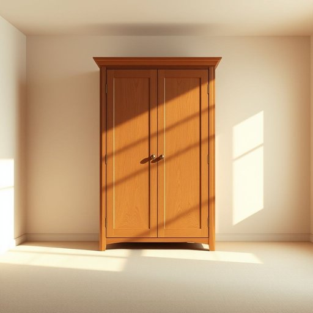

# armoire

<h1 style="font-size: 2.5em; font-weight: 300; letter-spacing: 2px; margin: 0; color: #2c3e50;">
/ˈɑmwɑr/
</h1>

---

---

## 例句

After examining the intricate design, the architect marveled at how the armoire served not only as a functional piece of furniture but also as a centerpiece that elevated the aesthetic appeal of the entire room.

*After(/ˈæftər/) examining(/ɪgˈzæmɪnɪŋ/) the(/ðə/) intricate(/ˈɪntrəkət/) design,(/dɪˈzaɪn,/) the(/ðə/) architect(/ˈɑrkəˌtɛkt/) marveled(/ˈmɑrvɛld/) at(/æt/) how(/haʊ/) the(/ðə/) armoire(/ˈɑmwɑr/) served(/sərvd/) not(/nɑt/) only(/ˈoʊnli/) as(/ɛz/) a(/ə/) functional(/ˈfəŋkʃənəl/) piece(/pis/) of(/əv/) furniture(/ˈfərnɪʧər/) but(/bət/) also(/ˈɔlsoʊ/) as(/ɛz/) a(/ə/) centerpiece(/ˈsɛntərˌpis/) that(/ðət/) elevated(/ˈɛləˌveɪtɪd/) the(/ðə/) aesthetic(/ɛsˈθɛtɪk/) appeal(/əˈpil/) of(/əv/) the(/ðə/) entire(/ɪnˈtaɪər/) room.(/rum./)*

**翻译：** 在仔细审视了这件精巧的设计后，建筑师惊叹于这座衣橱不仅是一件实用的家具，更成为了提升整个房间美感的焦点。

---

## 解释

“armoire”作为名词在家居生活用品的语境中指一种大型的、通常有门的家具，主要用于存放衣物、床上用品或其他家居物品，类似于中文中的“衣柜”或“衣橱”，但一般形体较为高大且设计较为古典。具体使用场合多见于描述卧室或更衣室的家具配置，尤其在强调欧洲风格或复古家具时常用此词。英语学习者需注意，armoire是可数名词，复数形式为armoires，使用时常搭配动词如“open an armoire”“put clothes in the armoire”等，且多与家具相关形容词搭配，如“large armoire”“wooden armoire”或“antique armoire”。词源方面，armoire源自法语，原意为“武器柜”或“储藏柜”，因其历史上最初用于存放武器和贵重物品，逐渐演变为存储衣物的家具，反映了欧洲家具设计的演变和文化背景。在中文语境中，armoire通常准确译作“衣柜”或“衣橱”，但要注意相较于普通“柜子”而言，它更多带有古典、精致、较大且有门的家具形象，无褒贬色彩，属于中性词汇，使用时可体现出家具陈设的风格和格调，常在高端家居描述或文学描写中出现，具有一定的文化品位象征。

---

<small style="color: #999; font-size: 0.9em;">2025-07-17 06:22:39</small>

