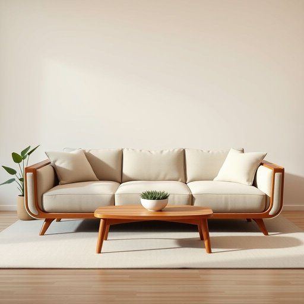

# armrest

<h1 style="font-size: 2.5em; font-weight: 300; letter-spacing: 2px; margin: 0; color: #2c3e50;">
/ˈɑrmˌrɛst/
</h1>

---

---

## 例句

After hours of careful consideration, the sofa in the living room became not only a piece of furniture but also a symbol of comfort and style that transformed the entire atmosphere.

*After(/ˈæftər/) hours(/aʊərz/) of(/əv/) careful(/ˈkɛrfəl/) consideration,(/kənˌsɪdərˈeɪʃən,/) the(/ðə/) sofa(/ˈsoʊfə/) in(/ɪn/) the(/ðə/) living(/ˈlɪvɪŋ/) room(/rum/) became(/bɪˈkeɪm/) not(/nɑt/) only(/ˈoʊnli/) a(/ə/) piece(/pis/) of(/əv/) furniture(/ˈfərnɪʧər/) but(/bət/) also(/ˈɔlsoʊ/) a(/ə/) symbol(/ˈsɪmbəl/) of(/əv/) comfort(/ˈkəmfərt/) and(/ənd/) style(/staɪl/) that(/ðət/) transformed(/trænsˈfɔrmd/) the(/ðə/) entire(/ɪnˈtaɪər/) atmosphere.(/ˈætməsˌfɪr./)*

**翻译：** 经过数小时的深思熟虑，客厅里的沙发不仅成为了一件家具，更象征着舒适与风格，改变了整个空间的氛围。

---

## 解释

英语单词“armrest”作为名词，主要指家具中为支撑手臂而设计的部分，常见于沙发、椅子、汽车座椅等家居生活用品中。在实际使用场合和语境中，armrest通常出现在描述家具结构、舒适度或功能性的情境，比如“a comfortable sofa with padded armrests”（带软垫扶手的舒适沙发）或“adjustable armrests on an office chair”（办公椅上可调节的扶手）。英语学习者在使用该词时需注意它为可数名词，复数形式为armrests，常用搭配包括“padded armrest”（软垫扶手）、“adjustable armrest”（可调节扶手）、“built-in armrest”（内置扶手）等，此外，表达技巧上常用形容词修饰以突出扶手的材质、功能或舒适程度。在语法结构中，“armrest”多作为名词直接作主语、宾语或定语使用，如“the armrest is broken”或“armrest height”。该词源自“arm”（手臂）与“rest”（休息、支撑）两个英语基本词汇组合，字面含义即“手臂的休息处”，反映了其功能性设计。中文语境中，armrest准确翻译为“扶手”或“扶手架”，指的是家具或座椅上专门让手臂休息的部分，没有特别贬义或褒义色彩，一般中性描述，其文化内涵较为直接，体现了现代家具设计中注重人体工程学和舒适性的趋势。

---

<small style="color: #999; font-size: 0.9em;">2025-07-17 06:22:39</small>

