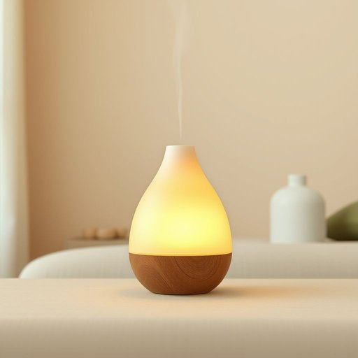

# aromalamp

<h1 style="font-size: 2.5em; font-weight: 300; letter-spacing: 2px; margin: 0; color: #2c3e50;">
/aromalamp*/
</h1>

---

---

## 例句

The concept of freedom, which has been debated by philosophers and politicians alike, remains a fundamental pillar in the structure of democratic societies, influencing legislation, individual rights, and collective responsibilities in profound ways.

*The(/ðə/) concept(/ˈkɑnsɛpt/) of(/əv/) freedom,(/ˈfridəm,/) which(/wɪʧ/) has(/həz/) been(/bɪn/) debated(/dəˈbeɪtɪd/) by(/baɪ/) philosophers(/fəˈlɑsəfərz/) and(/ənd/) politicians(/ˌpɑləˈtɪʃənz/) alike,(/əˈlaɪk,/) remains(/rɪˈmeɪnz/) a(/ə/) fundamental(/ˌfəndəˈmɛnəl/) pillar(/ˈpɪlər/) in(/ɪn/) the(/ðə/) structure(/ˈstrəkʧər/) of(/əv/) democratic(/ˌdɛməˈkrætɪk/) societies,(/səˈsaɪɪtiz,/) influencing(/ˈɪnˌfluənsɪŋ/) legislation,(/ˌlɛʤəsˈleɪʃən,/) individual(/ˌɪndəˈvɪʤəwəl/) rights,(/raɪts,/) and(/ənd/) collective(/kəˈlɛktɪv/) responsibilities(/riˌspɑnsəˈbɪlətiz/) in(/ɪn/) profound(/proʊˈfaʊnd/) ways.(/weɪz./)*

**翻译：** 自由的概念，历来为哲学家和政治家所热议，依然是民主社会结构中的基石，深刻影响着立法、个人权利与集体责任。

---

## 解释

单词aromalamp作为家居生活用品类名词通常指的是一种结合香薰功能的灯具既可以用作照明也能通过加热精油或香薰蜡烛散发出芳香营造舒适宜人的居家氛围它常见于客厅卧室或浴室等需要提升环境气味和氛围的场合使用时多配合香薰油或蜡烛英语学习者在使用该词时应注意其拼写和发音经常与aroma香气和lamp灯两个词合成因此属于复合名词通常不变形且前后顺序固定表达时多用单数形式也可以根据具体数量变为复数aromalamps常见搭配有aromalamp diffuser香薰灯扩散器aromalamp oil香薰灯用油等该词的词源为aroma与lamp的合成复合词体现了产品结合香薰与照明双重功能的设计理念反映了现代家居生活注重身心舒适的趋势在中文语境中aromalamp可准确翻译为香薰灯或香薰灯具是指能够通过灯光加热发出香气的装置不带贬义且多用于提升生活品质的正面表达具有怡神助眠净化空气的积极文化内涵

---

<small style="color: #999; font-size: 0.9em;">2025-07-17 06:22:39</small>

