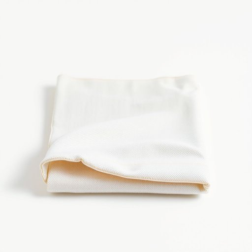

# article

<h1 style="font-size: 2.5em; font-weight: 300; letter-spacing: 2px; margin: 0; color: #2c3e50;">
/ˈɑrtɪkəl/
</h1>

---

---

## 例句

Before we close the order, could you please confirm whether the article we discussed yesterday—the eco-friendly, bamboo fiber kitchen towel known for its durability and quick-drying properties—is still available in stock, as I need it urgently to replace the worn-out one in my pantry?

*Before(/ˌbiˈfɔr/) we(/wi/) close(/kloʊz/) the(/ðə/) order,(/ˈɔrdər,/) could(/kʊd/) you(/ju/) please(/pliz/) confirm(/kənˈfərm/) whether(/ˈwɛðər/) the(/ðə/) article(/ˈɑrtɪkəl/) we(/wi/) discussed(/dɪˈskəst/) yesterday—the(/yesterday—the*/) eco-friendly,(/eco-friendly*,/) bamboo(/bæmˈbu/) fiber(/ˈfaɪbər/) kitchen(/ˈkɪʧən/) towel(/taʊəl/) known(/noʊn/) for(/fər/) its(/ɪts/) durability(/dərəˈbɪlɪti/) and(/ənd/) quick-drying(/quick-drying*/) properties—is(/properties—is*/) still(/stɪl/) available(/əˈveɪləbəl/) in(/ɪn/) stock,(/stɑk,/) as(/ɛz/) I(/aɪ/) need(/nid/) it(/ɪt/) urgently(/ˈərʤəntli/) to(/tɪ/) replace(/ˌriˈpleɪs/) the(/ðə/) worn-out(/worn-out*/) one(/wən/) in(/ɪn/) my(/maɪ/) pantry?(/ˈpæntri?/)*

**翻译：** 在我们下单之前，能否请您确认一下我们昨天讨论的那款以耐用性和速干性能著称的环保竹纤维厨房毛巾是否还有库存？我急需它来替换储藏室中已经磨损的那条。

---

## 解释

在家居生活用品的语境中，英语单词'article'作为名词，通常指具体的物品或商品，如“an article of furniture”（一件家具）或“household articles”（家居用品），使用场合多为描述某一类具体的单件物品，强调单独的个体。英语学习者在使用时需注意，article作为可数名词，复数形式为articles，且常与“of”连接，构成“articles of + 名词”表示某种类别的物品，如“articles of clothing”（衣物），“articles of daily use”（日用品）。此外，article除了物品外，还可指文章或条款，需要根据语境区分。在语法上，article作为名词时，用作主语、宾语等句子成分，与形容词连用时需保持数的一致。词源上，article来源于拉丁语“articulus”，意为小部分、小条，后引申为条文或具体物品，反映了其指代具体单元的特点。在中文语境中，article在家居生活用品领域常被准确翻译为“物品”、“用品”或“件”，强调单独存在的实物，避免与“文章”混淆。此词使用时无明显褒贬色彩或特殊文化内涵，属于中性词，用于正式或书面语境较多。整体而言，article作为家居用品的表达具备明确指代和数量区分的功能，是描述具体单件物品时的重要词汇。

---

<small style="color: #999; font-size: 0.9em;">2025-07-17 06:22:39</small>

