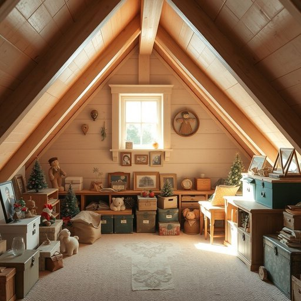

# attic

<h1 style="font-size: 2.5em; font-weight: 300; letter-spacing: 2px; margin: 0; color: #2c3e50;">
/ˈætɪk/
</h1>

---

---

## 例句

After the renovation of the kitchen was completed and the living room walls were freshly painted, I resolved to sift through the dusty attic boxes, which, though cramped and dimly lit, held an unexpected assortment of vintage holiday decorations, forgotten toys, and old photographs that had been stored away for decades.

*After(/ˈæftər/) the(/ðə/) renovation(/ˌrɛnəˈveɪʃən/) of(/əv/) the(/ðə/) kitchen(/ˈkɪʧən/) was(/wɑz/) completed(/kəmˈplitɪd/) and(/ənd/) the(/ðə/) living(/ˈlɪvɪŋ/) room(/rum/) walls(/wɔlz/) were(/wər/) freshly(/ˈfrɛʃli/) painted,(/ˈpeɪnɪd,/) I(/aɪ/) resolved(/riˈzɑlvd/) to(/tɪ/) sift(/sɪft/) through(/θru/) the(/ðə/) dusty(/ˈdəsti/) attic(/ˈætɪk/) boxes,(/ˈbɑksɪz,/) which,(/wɪʧ,/) though(/ðoʊ/) cramped(/kræmpt/) and(/ənd/) dimly(/ˈdɪmli/) lit,(/lɪt,/) held(/hɛld/) an(/ən/) unexpected(/ˌənɪkˈspɛktɪd/) assortment(/əˈsɔrtmənt/) of(/əv/) vintage(/ˈvɪntɪʤ/) holiday(/ˈhɑlɪˌdeɪ/) decorations,(/ˌdɛkərˈeɪʃənz,/) forgotten(/fərˈgɑtən/) toys,(/tɔɪz,/) and(/ənd/) old(/oʊld/) photographs(/ˈfoʊtəˌgræfs/) that(/ðət/) had(/hæd/) been(/bɪn/) stored(/stɔrd/) away(/əˈweɪ/) for(/fər/) decades.(/ˈdɛkeɪdz./)*

**翻译：** 厨房装修完毕，客厅墙壁重新粉刷后，我决定翻找那些尘封已久的阁楼箱子。虽然狭小且光线昏暗，但箱子里却意外地藏着一批复古的节日装饰、被遗忘的玩具和保存了数十年的老照片。

---

## 解释

英语单词“attic”在家居生活用品的语境中作为名词，主要指建筑物屋顶之下、墙顶和屋顶之间的空间，通常用作储藏室或有时改造成可居住的空间。在具体使用场合上，“attic”多用于描述房屋内部的结构部分，例如“to store boxes in the attic”（把箱子存放在阁楼里）或“an attic bedroom”（阁楼卧室），常见于谈论房屋布局、装修或家居整理时。英语学习者需要注意的是，“attic”作为可数名词，单数为attic，复数则为attics，且通常与表示存放、整理、装修、改造等动词搭配，如“clean the attic”（打扫阁楼）、“convert the attic”（改造阁楼）。此外，“attic”不宜与表示主要居住空间的词汇混淆，因其通常指附属空间，且在表达中常与“loft”有所区别，后者偏向于较为开放且多功能的顶层空间。词源方面，“attic”源自中古英语，源自拉丁语“atticus”，最初指的是希腊雅典附近的地区，后来引申为一种建筑风格中的装饰性上部空间，最终演变为现代英语中指代屋顶下方空间的含义。在中文语境中，“attic”一般翻译为“阁楼”或“顶楼夹层”，反映出其空间较小、位于房屋顶层的特点；有时也根据具体用途译为“屋顶间”或“顶楼储藏室”，需结合上下文判断。此词在使用中并无明显褒贬色彩，但因其常被视作杂物堆放处，语境中可能带有一定的陈旧或凌乱意味，尤其在描述家居整洁时。总体而言，理解“attic”不仅是空间位置的认知，还包含对其功能和文化背景的把握。

---

<small style="color: #999; font-size: 0.9em;">2025-07-17 06:22:39</small>

