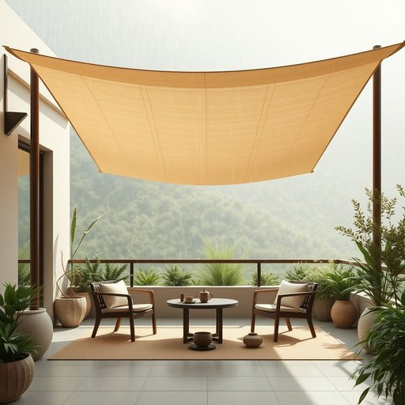

# awning

<h1 style="font-size: 2.5em; font-weight: 300; letter-spacing: 2px; margin: 0; color: #2c3e50;">
/ˈɑnɪŋ/
</h1>

---

---

## 例句

Although the weather forecast predicts rain later in the afternoon, my decision to install an awning over the patio reflects not only a practical response to unpredictable weather but also an appreciation for creating a versatile outdoor space where the awning serves as a shelter from sudden showers and glaring sunlight, enhancing the comfort and ambiance for enjoying tea amidst nature.

*Although(/ˌɔlˈðoʊ/) the(/ðə/) weather(/ˈwɛðər/) forecast(/ˈfɔrˌkæst/) predicts(/prɪˈdɪkts/) rain(/reɪn/) later(/ˈleɪtər/) in(/ɪn/) the(/ðə/) afternoon,(/ˌæftərˈnun,/) my(/maɪ/) decision(/dɪˈsɪʒən/) to(/tɪ/) install(/ˌɪnˈstɔl/) an(/ən/) awning(/ˈɑnɪŋ/) over(/ˈoʊvər/) the(/ðə/) patio(/ˈpætiˌoʊ/) reflects(/rɪˈflɛkts/) not(/nɑt/) only(/ˈoʊnli/) a(/ə/) practical(/ˈpræktɪkəl/) response(/rɪˈspɑns/) to(/tɪ/) unpredictable(/ˌənprɪˈdɪktəbəl/) weather(/ˈwɛðər/) but(/bət/) also(/ˈɔlsoʊ/) an(/ən/) appreciation(/əˌpriʃiˈeɪʃən/) for(/fər/) creating(/kriˈeɪtɪŋ/) a(/ə/) versatile(/ˈvərsətəl/) outdoor(/ˈaʊtˌdɔr/) space(/speɪs/) where(/wɛr/) the(/ðə/) awning(/ˈɑnɪŋ/) serves(/sərvz/) as(/ɛz/) a(/ə/) shelter(/ˈʃɛltər/) from(/frəm/) sudden(/ˈsədən/) showers(/ʃaʊərz/) and(/ənd/) glaring(/ˈglɛrɪŋ/) sunlight,(/ˈsənˌlaɪt,/) enhancing(/ɛnˈhænsɪŋ/) the(/ðə/) comfort(/ˈkəmfərt/) and(/ənd/) ambiance(/ˈæmbiəns/) for(/fər/) enjoying(/ˌɛnˈʤɔɪɪŋ/) tea(/ti/) amidst(/əˈmɪdst/) nature.(/ˈneɪʧər./)*

**翻译：** 尽管天气预报预示下午晚些时候会有降雨，我决定在露台上安装遮阳篷，这不仅是对多变天气的实用应对，更体现了对打造多功能户外空间的欣赏。遮阳篷既能遮挡突如其来的阵雨，又能阻挡刺眼的阳光，提升了在大自然中品茶时的舒适感和氛围。

---

## 解释

英语单词“awning”作为名词，在家居生活用品语境中指的是安装在窗户、门口或露台等处，用以遮阳挡雨的悬挂式遮篷或遮阳蓬，常见于住宅外墙或商业店铺外部。具体使用场合通常涉及户外保护，如防止阳光直射、减少室内温度或阻挡雨水，常见于描述家居装饰、户外生活空间设计等语境中。学习者在使用“awning”时需注意其不可数名词与可数名词的用法，一般指单个遮篷时用复数“awnings”，且常与介词“over”搭配（如“an awning over the patio”），还常与动词“extend”（伸出）、“retract”（收起）搭配表达其可伸缩特性。词源方面，“awning”源于中古英语“awnynge”，可能由古法语“hune”演变而来，原意均与遮盖物相关，体现其作为遮蔽物的基本功能。在中文语境中，“awning”准确翻译为“遮阳篷”或“遮阳蓬”，强调其实用性和户外防护功能，无明显褒贬含义，但在部分文化背景下，设计精美的awning可能体现主人生活品质或品味，具有一定的装饰性和象征意义。整体来看，“awning”是指为改善户外生活环境而安装的实用家居用品，学习者需结合具体语境掌握其用法和搭配。

---

<small style="color: #999; font-size: 0.9em;">2025-07-17 06:22:39</small>

