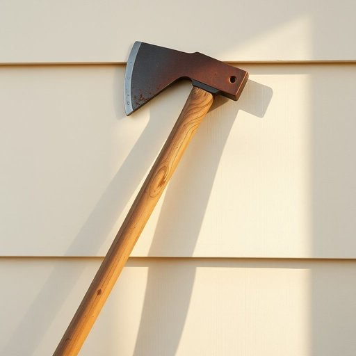

# axe

<h1 style="font-size: 2.5em; font-weight: 300; letter-spacing: 2px; margin: 0; color: #2c3e50;">
/æks/
</h1>

---

---

## 例句

Could you please hand me the axe from the shed, the one with the worn wooden handle and chipped blade, so that I can chop some firewood for the fireplace before the guests arrive this evening?

*Could(/kʊd/) you(/ju/) please(/pliz/) hand(/hænd/) me(/mi/) the(/ðə/) axe(/æks/) from(/frəm/) the(/ðə/) shed,(/ʃɛd,/) the(/ðə/) one(/wən/) with(/wɪθ/) the(/ðə/) worn(/wɔrn/) wooden(/ˈwʊdən/) handle(/ˈhændəl/) and(/ənd/) chipped(/ʧɪpt/) blade,(/bleɪd,/) so(/soʊ/) that(/ðət/) I(/aɪ/) can(/kən/) chop(/ʧɑp/) some(/səm/) firewood(/ˈfaɪərˌwʊd/) for(/fər/) the(/ðə/) fireplace(/ˈfaɪərˌpleɪs/) before(/ˌbiˈfɔr/) the(/ðə/) guests(/gɛsts/) arrive(/əraɪv/) this(/ðɪs/) evening?(/ˈivnɪŋ?/)*

**翻译：** 你能帮我从棚子里拿把斧头吗？就是那把木柄磨损、刀刃有些缺口的，我想用它劈些柴火，为今晚客人到来前的壁炉准备一些火料。

---

## 解释

英语单词“axe”作为名词在家居生活用品的语境中，通常指一种用于劈砍木材的工具，形状为一端装有锋利金属斧头、另一端为木制或金属柄的器具。具体使用场合多见于户外砍伐、野营生火准备或家庭园艺修剪等情境，尤其是在需要劈开木柴或枝桠时。学习者应注意，“axe”作为可数名词，其复数形式为“axes”；且在句中多作具体物体出现，如“一把锋利的斧头”。常见搭配有“用斧头劈砍”、“木制斧柄”等，表达时要注意区分“axe”动词用法（意为裁员或取消）与名词工具的用法。此外，“axe”源自古英语“æx, eax”，与古日耳曼语系同源词相通，历史悠久，反映了人类使用斧头作为基础工具的传统。在中文语境中，“axe”准确翻译为“斧头”，强调其作为砍伐工具的功能，通常无特殊褒贬含义，但在某些比喻或引申用法中，尤其是作为动词时，可能带有裁减、终止之意，具有一定的负面色彩。整体上，该词在家居生活用品范畴内属于实物具象词，使用时语义明确，文化内涵较为中性。

---

<small style="color: #999; font-size: 0.9em;">2025-07-17 06:22:39</small>

