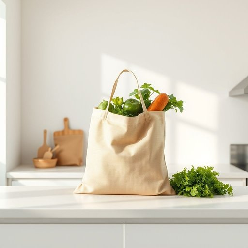

# bag

<h1 style="font-size: 2.5em; font-weight: 300; letter-spacing: 2px; margin: 0; color: #2c3e50;">
/bæg/
</h1>

---

---

## 例句

Could you please check if the bag on the kitchen counter, which has the groceries we bought earlier, includes the fresh vegetables and the loaf of bread that we need for tonight’s dinner?

*Could(/kʊd/) you(/ju/) please(/pliz/) check(/ʧɛk/) if(/ɪf/) the(/ðə/) bag(/bæg/) on(/ɔn/) the(/ðə/) kitchen(/ˈkɪʧən/) counter,(/ˈkaʊntər,/) which(/wɪʧ/) has(/həz/) the(/ðə/) groceries(/ˈgroʊsəriz/) we(/wi/) bought(/bɔt/) earlier,(/ˈərliər,/) includes(/ˌɪnˈkludz/) the(/ðə/) fresh(/frɛʃ/) vegetables(/ˈvɛʤtəbəlz/) and(/ənd/) the(/ðə/) loaf(/loʊf/) of(/əv/) bread(/brɛd/) that(/ðət/) we(/wi/) need(/nid/) for(/fər/) tonight’s(/tonight’s*/) dinner?(/ˈdɪnər?/)*

**翻译：** 请您帮忙确认一下放在厨房台面上的那个袋子——里面装着我们刚买的杂货——是否包括我们今晚晚餐所需的新鲜蔬菜和一条面包？

---

## 解释

英语单词“bag”作为名词在家居生活用品的语境中通常指用来装东西的袋子材质可以是布塑料纸或皮革常见于购物袋收纳袋垃圾袋等具体物品使用场合多涉及存放携带日常用品如shopping bag购物袋storage bag收纳袋或garbage bag垃圾袋体现其实用功能英语学习者使用bag时需注意其可数性通常作为可数名词使用例如一只包应说a bag复数形式为bags常见搭配包括big bag大包plastic bag塑料袋carry a bag携带袋子等此外要区分bag与backpackpurse等具体包类词汇以避免混淆该词源自古英语bagg可能来源于古北欧语原意即指容器或袋子历史上主要用以装载和携带物品中文语境中bag通常翻译为袋子包涵义较为宽泛且具体需根据上下文选择准确词义如强调材质或用途时会有不同的汉语表达该词语本身无明显褒贬色彩属于中性词汇文化内涵较弱但在某些固定搭配中可能体现时尚或地域特色如handbag手提包涉及个人风格总之bag作为家居生活用品的名称在表达存储和携带功能上极为基础且广泛是英语学习和日常交流中必备的常用词。

---

<small style="color: #999; font-size: 0.9em;">2025-07-17 06:22:39</small>

