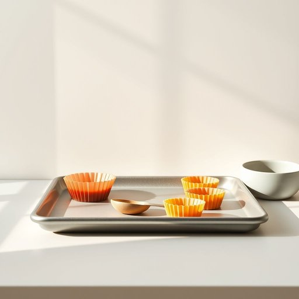

# bakeware

<h1 style="font-size: 2.5em; font-weight: 300; letter-spacing: 2px; margin: 0; color: #2c3e50;">
/ˈbeɪkˌwɛr/
</h1>

---

---

## 例句

Before we start preparing the Christmas pudding, could you please check if the new bakeware we bought last week, which includes the non-stick roasting tray and the set of silicone muffin tins, is already washed and ready to use, as I want to make sure everything is perfect for the oven?

*Before(/ˌbiˈfɔr/) we(/wi/) start(/stɑrt/) preparing(/pərˈpɛrɪŋ/) the(/ðə/) Christmas(/ˈkrɪsməs/) pudding,(/ˈpʊdɪŋ,/) could(/kʊd/) you(/ju/) please(/pliz/) check(/ʧɛk/) if(/ɪf/) the(/ðə/) new(/nu/) bakeware(/ˈbeɪkˌwɛr/) we(/wi/) bought(/bɔt/) last(/læst/) week,(/wik,/) which(/wɪʧ/) includes(/ˌɪnˈkludz/) the(/ðə/) non-stick(/nɑnˈstɪk/) roasting(/ˈroʊstɪŋ/) tray(/treɪ/) and(/ənd/) the(/ðə/) set(/sɛt/) of(/əv/) silicone(/ˈsɪləˌkoʊn/) muffin(/ˈməfən/) tins,(/tɪnz,/) is(/ɪz/) already(/ɔˈrɛdi/) washed(/wɑʃt/) and(/ənd/) ready(/ˈrɛdi/) to(/tɪ/) use,(/juz,/) as(/ɛz/) I(/aɪ/) want(/wɔnt/) to(/tɪ/) make(/meɪk/) sure(/ʃʊr/) everything(/ˈɛvriˌθɪŋ/) is(/ɪz/) perfect(/ˈpərˌfɪkt/) for(/fər/) the(/ðə/) oven?(/ˈəvən?/)*

**翻译：** 在我们开始准备圣诞布丁之前，你能帮忙确认一下上周买的新烘焙器具是否已经清洗干净并可以使用吗？包括不粘烤盘和硅胶松饼模具套装，我想确保一切完美，方便放进烤箱。

---

## 解释

英语单词“bakeware”作为名词，主要指用于烘焙的器具或容器，如烤盘、烤碗、烤模等，这些器具通常由玻璃、陶瓷、金属等耐高温材料制成，适用于烤箱中烘烤食物。在家居生活用品的语境中，“bakeware”通常出现在讨论厨房用具、烘焙工具或购买烘烤设备时，如“kitchen bakeware sets”表示厨房烘焙用具套装。英语学习者使用“bakeware”时需注意其不可数名词的用法，通常不直接用复数形式，若谈论多种烘焙器具时，依然使用bakeware；可搭配的词汇有“purchase bakeware”（购买烘焙器具）、“high-quality bakeware”（高质量烘焙器具）等。此外，“bakeware”本身结构为“bake”（烤）+“ware”（器具、用品），属于合成词，起源反映了其功能即烘烤用途的器具，符合英语中以动词加名词构成物品名称的常见命名方式。在中文语境中，“bakeware”通常被准确翻译为“烘焙器具”或“烤箱用具”，强调其用途和耐高温特性，区别于一般厨房用具，便于理解其专业性和特定使用范围。该词没有特殊的褒贬色彩，属于中性实用词汇；不过在欧美文化中，随着家庭烘焙的普及，“bakeware”也带有一定的生活美学或健康饮食的积极文化内涵。

---

<small style="color: #999; font-size: 0.9em;">2025-07-17 06:22:39</small>

