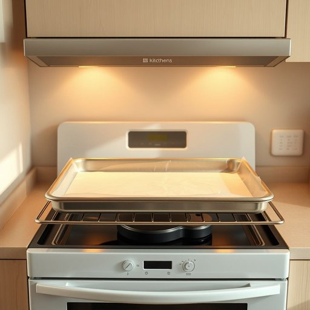

# baking-tray

<h1 style="font-size: 2.5em; font-weight: 300; letter-spacing: 2px; margin: 0; color: #2c3e50;">
/baking-tray*/
</h1>

---

---

## 例句

Before you put the cookies in the oven, make sure the baking-tray is properly lined with parchment paper and positioned in the middle rack, as this will help them bake evenly without burning on the bottom or sticking to the surface.

*Before(/ˌbiˈfɔr/) you(/ju/) put(/pʊt/) the(/ðə/) cookies(/ˈkʊkiz/) in(/ɪn/) the(/ðə/) oven,(/ˈəvən,/) make(/meɪk/) sure(/ʃʊr/) the(/ðə/) baking-tray(/baking-tray*/) is(/ɪz/) properly(/ˈprɑpərli/) lined(/laɪnd/) with(/wɪθ/) parchment(/ˈpɑrʧmənt/) paper(/ˈpeɪpər/) and(/ənd/) positioned(/pəˈzɪʃənd/) in(/ɪn/) the(/ðə/) middle(/ˈmɪdəl/) rack,(/ræk,/) as(/ɛz/) this(/ðɪs/) will(/wɪl/) help(/hɛlp/) them(/ðɛm/) bake(/beɪk/) evenly(/ˈivənli/) without(/wɪˈθaʊt/) burning(/ˈbərnɪŋ/) on(/ɔn/) the(/ðə/) bottom(/ˈbɑtəm/) or(/ər/) sticking(/ˈstɪkɪŋ/) to(/tɪ/) the(/ðə/) surface.(/ˈsərfəs./)*

**翻译：** 在将饼干放入烤箱之前，请确保烤盘已妥善铺好烘焙纸，并置于中层烤架上，这样可以帮助饼干均匀烘烤，避免底部烤焦或粘连。

---

## 解释

英语单词“baking tray”作为名词，指的是一种用于烘焙的平底金属盘，通常用于将食物放入烤箱中加热或烘烤，常见于家庭厨房和餐饮业场合，比如烤面包、饼干、披萨等。学习者在使用“baking tray”时应注意其作为可数名词的用法，通常前面带冠词如“a baking tray”或定冠词“the baking tray”，复数形式为“baking trays”。常见搭配包括“put something on a baking tray”（把某物放在烤盘上）、“line a baking tray with parchment paper”（用烘焙纸铺烤盘）、以及“preheat the oven and place the baking tray inside”（预热烤箱后放入烤盘）。词源方面，“baking”来自动词“bake”（烘烤），而“tray”意为托盘，两词组合即表示用于烘焙的盘子。中文语境中“baking tray”通常准确翻译为“烤盘”或“烘焙盘”，指厨房中的烤箱用具，无特殊文化色彩或褒贬含义，属于中性词汇，主要反映厨房烹饪工具的功能属性。

---

<small style="color: #999; font-size: 0.9em;">2025-07-17 06:22:39</small>

