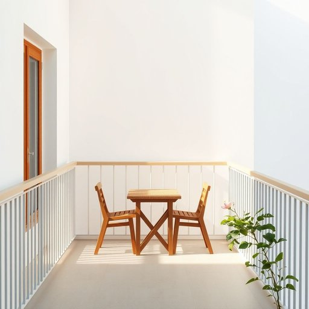

# balcony

<h1 style="font-size: 2.5em; font-weight: 300; letter-spacing: 2px; margin: 0; color: #2c3e50;">
/ˈbælkəni/
</h1>

---

---

## 例句

I love spending the quiet mornings on the balcony, where the fresh air mingles with the scent of blooming flowers from the neighbouring gardens, creating the perfect spot not only for my breakfast but also for reading a good book before the day gets busy.

*I(/aɪ/) love(/ləv/) spending(/ˈspɛndɪŋ/) the(/ðə/) quiet(/kwaɪət/) mornings(/ˈmɔrnɪŋz/) on(/ɔn/) the(/ðə/) balcony,(/ˈbælkəni,/) where(/wɛr/) the(/ðə/) fresh(/frɛʃ/) air(/ɛr/) mingles(/ˈmɪŋgəlz/) with(/wɪθ/) the(/ðə/) scent(/sɛnt/) of(/əv/) blooming(/ˈblumɪŋ/) flowers(/flaʊərz/) from(/frəm/) the(/ðə/) neighbouring(/ˈneɪbərɪŋ/) gardens,(/ˈgɑrdənz,/) creating(/kriˈeɪtɪŋ/) the(/ðə/) perfect(/ˈpərˌfɪkt/) spot(/spɑt/) not(/nɑt/) only(/ˈoʊnli/) for(/fər/) my(/maɪ/) breakfast(/ˈbrɛkfəst/) but(/bət/) also(/ˈɔlsoʊ/) for(/fər/) reading(/ˈrɛdɪŋ/) a(/ə/) good(/gʊd/) book(/bʊk/) before(/ˌbiˈfɔr/) the(/ðə/) day(/deɪ/) gets(/gɪts/) busy.(/ˈbɪzi./)*

**翻译：** 我喜欢在阳台上度过宁静的清晨，那里新鲜的空气与邻家花园盛开的花香交织，营造出一个理想的环境，不仅适合享用早餐，也适合在忙碌的一天开始前静心阅读一本好书。

---

## 解释

“balcony”作为名词在家居生活用品的语境中，指建筑物外墙突出部分的阳台，通常为悬挑结构，配有栏杆或护栏，供居民在室外休憩、观景或晾晒衣物等。具体使用场合多出现在描述住宅、公寓或酒店等场所时，如“The apartment has a balcony overlooking the garden”（这套公寓有一个俯瞰花园的阳台）。英语学习者使用“balcony”时应注意其作为可数名词，有单复数形式“balcony/balconies”，在表达特定位置时可用介词短语如“on the balcony”（在阳台上），“from the balcony”（从阳台上）等，常见搭配还有“balcony door”（阳台门）、“balcony railing”（阳台栏杆）等。此外，“balcony seat”常指剧院或运动场的楼座，但在家居生活语境中应避免混用。词源上，“balcony”源自意大利语“balcone”，最初来自中古拉丁语“balcone”，意为突出的窗台或平台，反映了其建筑结构特点。中文中“阳台”是对“balcony”的准确翻译，强调其作为室外延伸空间的功能，与“露台”或“平台”在结构上有区别，不宜混淆。该词无明显褒贬色彩，但在不同文化中阳台的设计和使用习惯不同，如某些地区阳台是重要的社交场所或生活空间。总体而言，“balcony”在家居语境中是一个中性描述性名词，指代附属于住宅的室外小平台，为日常生活增添便利和舒适。

---

<small style="color: #999; font-size: 0.9em;">2025-07-17 06:22:39</small>

