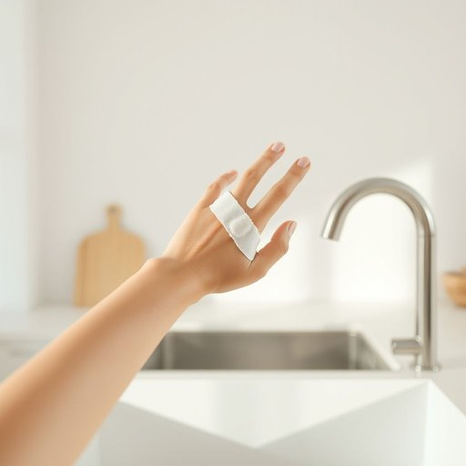

# bandage

<h1 style="font-size: 2.5em; font-weight: 300; letter-spacing: 2px; margin: 0; color: #2c3e50;">
/ˈbændɪʤ/
</h1>

---

---

## 例句

After I accidentally cut my finger while chopping vegetables, I quickly grabbed a clean bandage from the first aid kit under the sink, which not only helped stop the bleeding but also prevented any dirt from getting into the wound, allowing me to carry on preparing dinner without worry.

*After(/ˈæftər/) I(/aɪ/) accidentally(/ˌæksəˈdɛnəli/) cut(/kət/) my(/maɪ/) finger(/ˈfɪŋgər/) while(/waɪl/) chopping(/ˈʧɑpɪŋ/) vegetables,(/ˈvɛʤtəbəlz,/) I(/aɪ/) quickly(/kˈwɪkli/) grabbed(/græbd/) a(/ə/) clean(/klin/) bandage(/ˈbændɪʤ/) from(/frəm/) the(/ðə/) first(/fərst/) aid(/eɪd/) kit(/kɪt/) under(/ˈəndər/) the(/ðə/) sink,(/sɪŋk,/) which(/wɪʧ/) not(/nɑt/) only(/ˈoʊnli/) helped(/hɛlpt/) stop(/stɑp/) the(/ðə/) bleeding(/ˈblidɪŋ/) but(/bət/) also(/ˈɔlsoʊ/) prevented(/prɪˈvɛnɪd/) any(/ˈɛni/) dirt(/dərt/) from(/frəm/) getting(/ˈgɪtɪŋ/) into(/ˈɪntu/) the(/ðə/) wound,(/wund,/) allowing(/əˈlaʊɪŋ/) me(/mi/) to(/tɪ/) carry(/ˈkɛri/) on(/ɔn/) preparing(/pərˈpɛrɪŋ/) dinner(/ˈdɪnər/) without(/wɪˈθaʊt/) worry.(/ˈwəri./)*

**翻译：** 切菜时不小心割伤了手指，我迅速从水槽下的急救箱里拿出一块干净的绷带，不仅止住了出血，还防止了污垢进入伤口，使我能够放心地继续准备晚餐。

---

## 解释

“bandage”作为名词在家居生活用品的语境中，通常指用于包扎伤口的绷带或敷料，主要用于止血、防止感染或固定受伤部位，具体使用场合包括家庭急救箱、护理中或意外受伤时，如小孩划伤、轻微割伤等情况，英语学习者在使用该词时需注意其单复数形式，单数为“a bandage”，复数为“bandages”，且常与动词“to put on”、“to apply”或形容词如“sterile”（无菌的）、“elastic”（弹性的）等搭配，如“apply a bandage”、“elastic bandage”，另外，bandage多指布质或弹性材料制成的包扎物，而不是药膏或贴片，使用时不要与“plaster”或“sticking plaster”（创可贴）混淆，词源上，“bandage”来源于中古法语“bander”意为“绑扎”，最终源自拉丁语“bandum”，指绑带，这体现其功能性绑扎用途，中文语境中准确翻译为“绷带”，强调其辅助治疗的物理包扎作用，无明显褒贬色彩，使用时注意，bandage多指以布料制成的包扎材料，若指创可贴或药膏则不适用，避免理解混淆，总体而言，bandage是英语日常生活和医疗护理中常见的词汇，理解其具体用途和正确搭配有助于准确表达伤口处理场景。

---

<small style="color: #999; font-size: 0.9em;">2025-07-17 06:22:39</small>

