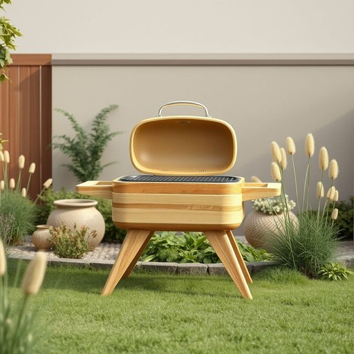

# barbecue

<h1 style="font-size: 2.5em; font-weight: 300; letter-spacing: 2px; margin: 0; color: #2c3e50;">
/ˈbɑrbɪˌkju/
</h1>

---

---

## 例句

Whenever the weather is warm and sunny, we usually drag out the barbecue from the shed, carefully clean it to remove any rust or leftover ash from previous use, and gather all the necessary utensils, marinades, and fresh vegetables so that we can enjoy a proper alfresco meal with friends and family in the garden.

*Whenever(/wɛˈnɛvər/) the(/ðə/) weather(/ˈwɛðər/) is(/ɪz/) warm(/wɔrm/) and(/ənd/) sunny,(/ˈsəni,/) we(/wi/) usually(/ˈjuʒəwəli/) drag(/dræg/) out(/aʊt/) the(/ðə/) barbecue(/ˈbɑrbɪˌkju/) from(/frəm/) the(/ðə/) shed,(/ʃɛd,/) carefully(/ˈkɛrfəli/) clean(/klin/) it(/ɪt/) to(/tɪ/) remove(/riˈmuv/) any(/ˈɛni/) rust(/rəst/) or(/ər/) leftover(/ˈlɛfˌtoʊvər/) ash(/æʃ/) from(/frəm/) previous(/ˈpriviəs/) use,(/juz,/) and(/ənd/) gather(/ˈgæðər/) all(/ɔl/) the(/ðə/) necessary(/ˈnɛsəˌsɛri/) utensils,(/juˈtɛnsəlz,/) marinades,(/ˈmɑrɪˌneɪdz,/) and(/ənd/) fresh(/frɛʃ/) vegetables(/ˈvɛʤtəbəlz/) so(/soʊ/) that(/ðət/) we(/wi/) can(/kən/) enjoy(/ˌɛnˈʤɔɪ/) a(/ə/) proper(/ˈprɑpər/) alfresco(/alfresco*/) meal(/mil/) with(/wɪθ/) friends(/frɛndz/) and(/ənd/) family(/ˈfæməli/) in(/ɪn/) the(/ðə/) garden.(/ˈgɑrdən./)*

**翻译：** 每当天气温暖晴朗时，我们通常会从棚子里搬出烧烤架，仔细清理，去除锈迹和上次使用后残留的灰烬，然后准备好所有必需的炊具、腌料和新鲜蔬菜，和亲朋好友在花园里尽情享受一顿美好的户外烧烤。

---

## 解释

英语单词“barbecue”作为名词，在家居生活用品的语境中通常指用于户外烧烤的器具或设备，如烧烤架、烤炉等，多用于家庭花园、露台或野外聚会烹饪食物的场合。学习者需要注意该词既可指代实体的烧烤设备，也可泛指烧烤活动本身，这取决于语境；此外，作为名词时通常可以加冠词（a barbecue）或复数形式（barbecues），且常与动词“have”搭配，表达“举行烧烤聚会”（have a barbecue）。词源方面，“barbecue”来源于西班牙语“barbacoa”，最初指一种将肉类架在火上慢烤的原始烹饪方式，后来被英语借用并拓展为现代的烧烤设备及活动含义。在中文环境中，“barbecue”准确翻译为“烧烤架”或“烧烤炉”，有时也泛指“烧烤活动”，需要根据具体语境判断。值得注意的是，“barbecue”在英美文化中往往带有轻松社交、户外聚会的积极色彩，无明显褒贬，但在不同文化背景下理解和接受度有所差异。

---

<small style="color: #999; font-size: 0.9em;">2025-07-17 06:22:39</small>

