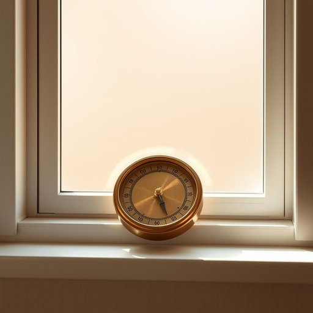

# barometer

<h1 style="font-size: 2.5em; font-weight: 300; letter-spacing: 2px; margin: 0; color: #2c3e50;">
/bərˈɑmɪtər/
</h1>

---

---

## 例句

I always keep the old brass barometer on the windowsill in the living room, not only because it adds a touch of vintage charm to the decor, but also because it reliably indicates changes in the weather, which helps me decide whether to open the windows for fresh air or keep them shut to avoid the damp chill.

*I(/aɪ/) always(/ˈɔlˌweɪz/) keep(/kip/) the(/ðə/) old(/oʊld/) brass(/bræs/) barometer(/bərˈɑmɪtər/) on(/ɔn/) the(/ðə/) windowsill(/windowsill*/) in(/ɪn/) the(/ðə/) living(/ˈlɪvɪŋ/) room,(/rum,/) not(/nɑt/) only(/ˈoʊnli/) because(/bɪˈkəz/) it(/ɪt/) adds(/ædz/) a(/ə/) touch(/təʧ/) of(/əv/) vintage(/ˈvɪntɪʤ/) charm(/ʧɑrm/) to(/tɪ/) the(/ðə/) decor,(/ˈdeɪkɔr,/) but(/bət/) also(/ˈɔlsoʊ/) because(/bɪˈkəz/) it(/ɪt/) reliably(/rɪˈlaɪəbli/) indicates(/ˈɪndɪˌkeɪts/) changes(/ˈʧeɪnʤɪz/) in(/ɪn/) the(/ðə/) weather,(/ˈwɛðər,/) which(/wɪʧ/) helps(/hɛlps/) me(/mi/) decide(/ˌdɪˈsaɪd/) whether(/ˈwɛðər/) to(/tɪ/) open(/ˈoʊpən/) the(/ðə/) windows(/ˈwɪndoʊz/) for(/fər/) fresh(/frɛʃ/) air(/ɛr/) or(/ər/) keep(/kip/) them(/ðɛm/) shut(/ʃət/) to(/tɪ/) avoid(/əˈvɔɪd/) the(/ðə/) damp(/dæmp/) chill.(/ʧɪl./)*

**翻译：** 我总是把那只旧铜制气压计放在客厅的窗台上，不仅因为它为装饰增添了一抹复古韵味，更因它能准确反映天气变化，帮助我判断是开窗通风，还是关窗避开潮湿的寒意。

---

## 解释

单词“barometer”作为名词在家居生活用品的语境中，通常指一种用于测量气压的仪器，这种仪器常摆放在家庭或室内环境中以帮助预测天气变化，尤其在气象兴趣或日常生活中关注天气状况的人群中较为常见。英语学习者在使用“barometer”时应注意其不可数和可数用法的区分，多数情况下可数形式表示具体的气压计仪器，常见搭配有“一台气压计”、 “精确的气压计”、 “挂墙式气压计”等，表达时往往结合动词如“读数”、“安装”、“检查”等，以描述气压测量的动作或状态。词源上，“barometer”来源于希腊语“baros”（重量、压力）和“metron”（计量），由英格兰科学家托里拆利于17世纪发明气压计时创造，体现了测量大气压力的科学工具属性。在中文语境中，“barometer”准确翻译为“气压计”，是气象仪器的一种，侧重于科学与生活中天气变化的预示功能，没有褒贬色彩，属于中性、技术性较强的名词，通常不会带有特别的文化内涵，但在日常表达中也可比喻为“风向标”、“变化的迹象”等象征意义，用以隐喻某种趋势或标准。

---

<small style="color: #999; font-size: 0.9em;">2025-07-17 06:22:39</small>

