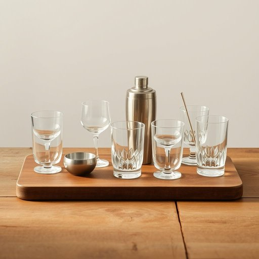

# barware

<h1 style="font-size: 2.5em; font-weight: 300; letter-spacing: 2px; margin: 0; color: #2c3e50;">
/barware*/
</h1>

---

---

## 例句

Whenever we host guests, the barware displayed on the vintage table—comprising crystal tumblers, a silver cocktail shaker, and an assortment of elegantly designed stirrers—becomes the centerpiece of conversations that delve into family traditions and the art of classic mixology.

*Whenever(/wɛˈnɛvər/) we(/wi/) host(/hoʊst/) guests,(/gɛsts,/) the(/ðə/) barware(/barware*/) displayed(/dɪˈspleɪd/) on(/ɔn/) the(/ðə/) vintage(/ˈvɪntɪʤ/) table—comprising(/table—comprising*/) crystal(/ˈkrɪstəl/) tumblers,(/ˈtəmblərz,/) a(/ə/) silver(/ˈsɪlvər/) cocktail(/ˈkɑkˌteɪl/) shaker,(/ˈʃeɪkər,/) and(/ənd/) an(/ən/) assortment(/əˈsɔrtmənt/) of(/əv/) elegantly(/ˈɛlɪgənˌtli/) designed(/dɪˈzaɪnd/) stirrers—becomes(/stirrers—becomes*/) the(/ðə/) centerpiece(/ˈsɛntərˌpis/) of(/əv/) conversations(/ˌkɑnvərˈseɪʃənz/) that(/ðət/) delve(/dɛlv/) into(/ˈɪntu/) family(/ˈfæməli/) traditions(/trəˈdɪʃənz/) and(/ənd/) the(/ðə/) art(/ɑrt/) of(/əv/) classic(/ˈklæsɪk/) mixology.(/ˈmɪkˈsɔləˌgi./)*

**翻译：** 每当我们招待宾客时，摆放在复古桌上的酒具——包括水晶威士忌杯、银制调酒器以及一系列设计雅致的搅拌棒——便成为话题的焦点，引发关于家族传统与经典调酒艺术的深入交流。

---

## 解释

“barware”作为名词，指的是与酒吧或调酒相关的器具和用品，主要用于家居生活中调制和享用饮品的场合，如酒杯、摇酒器、量酒器、吧匙等各种酒吧用具。它常出现在描述家庭酒吧设备、派对准备或餐饮服务相关的语境中。例如，描述一个人购买“barware”以装备自己的家庭酒吧，或在商店里寻找合适的调酒器具时。英语学习者在使用“barware”时应注意它是不可数名词，通常以单数形式出现，不需复数变化，且常与表示种类、品牌或数量的词连用，如“一套barware”或“优质barware”表达品质好的酒吧器具。此外，“barware”多用作集合名词，强调一类物品的总体概念，搭配形容词时多用表示材质、设计风格或用途的词汇。这个词源于“bar”（酒吧）与“ware”（器具、物品）的结合，反映其专属性和功能性，起初主要指商业酒吧中使用的器具，后逐渐延伸至家庭等私人环境中使用的相关用品。在中文语境中，“barware”通常翻译为“酒吧器具”或“调酒器具”，强调其实用性而非装饰性，不能简单理解为普通的家居用品，而是专指与调酒和饮酒相关的专用用具。该词本身较为中性，无褒贬色彩，不过在特定文化背景下，拥有一套精美的barware可能暗示生活品质和社交能力的提升，因此在某些场合带有一定的正面文化内涵。

---

<small style="color: #999; font-size: 0.9em;">2025-07-17 06:22:39</small>

