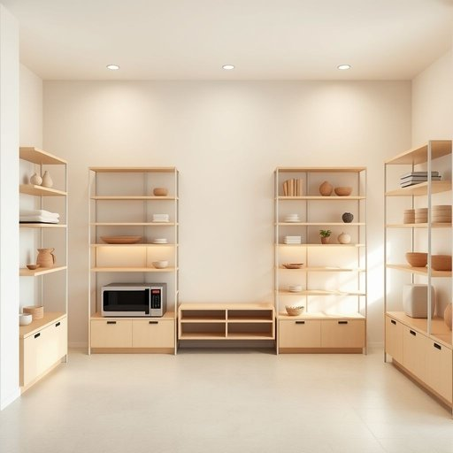

# basement

<h1 style="font-size: 2.5em; font-weight: 300; letter-spacing: 2px; margin: 0; color: #2c3e50;">
/ˈbeɪsmənt/
</h1>

---

---

## 例句

Before the decision on the shelving units, the basement’s dampness and ventilation as well as the space for decorations and appliances were considered carefully.

*Before(/ˌbiˈfɔr/) the(/ðə/) decision(/dɪˈsɪʒən/) on(/ɔn/) the(/ðə/) shelving(/ˈʃɛlvɪŋ/) units,(/ˈjunɪts,/) the(/ðə/) basement’s(/basement’s*/) dampness(/ˈdæmpnɪs/) and(/ənd/) ventilation(/ˌvɛntɪˈleɪʃən/) as(/ɛz/) well(/wɛl/) as(/ɛz/) the(/ðə/) space(/speɪs/) for(/fər/) decorations(/ˌdɛkərˈeɪʃənz/) and(/ənd/) appliances(/əˈplaɪənsɪz/) were(/wər/) considered(/kənˈsɪdərd/) carefully.(/ˈkɛrfəli./)*

**翻译：** 在决定货架方案之前，地下室的潮湿状况和通风情况，以及摆放装饰品和家电的空间，都经过了仔细考虑。

---

## 解释

英语单词basement在家居生活用品场景中作为名词主要指建筑物或房屋的地下室通常是低于地面的一层空间常用于储藏物品放置家用设备如锅炉水泵或改装成额外的居住娱乐或工作区域具体使用场合多见于描述住房结构房屋装修或租售信息等语境中例如the basement is used for storage地下室用来储藏东西basement这个词在语法上是可数名词复数形式为basements搭配常见的有in the basement在地下室basement apartment地下室公寓basement window地下室窗户等表达学习者需要注意其作为位置名词时通常用介词in而非on词源方面basement源自中古英语basement其根源是法语basement源自拉丁语bassus意指低的反映其位置通常低于地面的特点在中文语境中basement准确翻译为地下室强调的是房屋或建筑物结构中低于地面的部分常用于存放杂物或作为附属功能区文化上通常没有褒贬色彩但在某些语境中地下室可能暗含潮湿潮冷或采光不足的负面印象需要根据具体情境灵活理解

---

<small style="color: #999; font-size: 0.9em;">2025-07-17 06:22:39</small>

