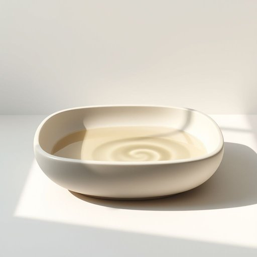

# basin

<h1 style="font-size: 2.5em; font-weight: 300; letter-spacing: 2px; margin: 0; color: #2c3e50;">
/ˈbeɪsən/
</h1>

---

---

## 例句

Could you please fill the basin with warm water and add a dash of lavender-scented soap, so that I can soak my aching feet after the long day we spent gardening in the chilly, damp weather?

*Could(/kʊd/) you(/ju/) please(/pliz/) fill(/fɪl/) the(/ðə/) basin(/ˈbeɪsən/) with(/wɪθ/) warm(/wɔrm/) water(/ˈwɔtər/) and(/ənd/) add(/æd/) a(/ə/) dash(/dæʃ/) of(/əv/) lavender-scented(/lavender-scented*/) soap,(/soʊp,/) so(/soʊ/) that(/ðət/) I(/aɪ/) can(/kən/) soak(/soʊk/) my(/maɪ/) aching(/ˈeɪkɪŋ/) feet(/fit/) after(/ˈæftər/) the(/ðə/) long(/lɔŋ/) day(/deɪ/) we(/wi/) spent(/spɛnt/) gardening(/ˈgɑrdənɪŋ/) in(/ɪn/) the(/ðə/) chilly,(/ˈʧɪli,/) damp(/dæmp/) weather?(/ˈwɛðər?/)*

**翻译：** 请您帮我用温水将盆子盛满，加入少许薰衣草香皂，这样我就能在我们整日劳作于寒冷潮湿的花园后，浸泡那双酸痛的双脚。

---

## 解释

英语单词“basin”在家居生活用品的语境中，作为名词通常指洗脸盆、水盆或盥洗盆，即一种用于盛水或洗涤的容器，常见于浴室或厨房中，供日常洗手、洗脸或清洁使用。在具体使用场合上，“basin”多用于描述固定安装的洗脸盆，如bathroom basin，或者便携式的容器，比如washing basin。英语学习者在使用该词时需要注意，“basin”作为可数名词，其复数形式为“basins”，且常与动词搭配，如“fill a basin with water”表示“往盆里装水”，“wash one’s face in the basin”表示“在盆里洗脸”。此外，“basin”常与形容词连用，如“shallow basin”（浅盆）、“ceramic basin”（陶瓷盆）、“stainless steel basin”（不锈钢盆）等，以描述材质或形状。词源上，“basin”起源于中古法语“bacin”，继而源自拉丁语“bacinus”，意为大碗或盛器，反映其作为容器的基本含义。中文语境中，“basin”常译为“盆”或“洗脸盆”，理解时需根据上下文区分是固定的洗脸池还是便携式的盆具，属于中性词汇，无特殊褒贬含义，但在英国英语中“basin”一般指洗脸盆，而在美国英语中更常用“sink”表示较大且固定的洗涤槽，学习者需注意地域差异。此外，“basin”在日常用语中不带有特别文化色彩或情感色彩，属于生活化的常用词汇。

---

<small style="color: #999; font-size: 0.9em;">2025-07-17 06:22:39</small>

