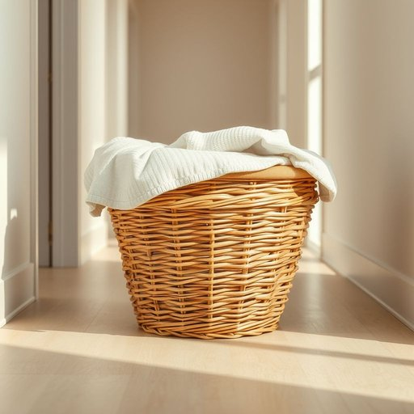

# basket

<h1 style="font-size: 2.5em; font-weight: 300; letter-spacing: 2px; margin: 0; color: #2c3e50;">
/ˈbæskət/
</h1>

---

---

## 例句

Could you please empty the laundry basket in the hallway, which is overflowing with clothes that need sorting, before you start tidying the living room and arranging the cushions on the sofa?

*Could(/kʊd/) you(/ju/) please(/pliz/) empty(/ˈɛmti/) the(/ðə/) laundry(/ˈlɔndri/) basket(/ˈbæskət/) in(/ɪn/) the(/ðə/) hallway,(/ˈhɔlˌweɪ,/) which(/wɪʧ/) is(/ɪz/) overflowing(/ˈoʊvərˌfloʊɪŋ/) with(/wɪθ/) clothes(/kloʊðz/) that(/ðət/) need(/nid/) sorting,(/ˈsɔrtɪŋ,/) before(/ˌbiˈfɔr/) you(/ju/) start(/stɑrt/) tidying(/tidying*/) the(/ðə/) living(/ˈlɪvɪŋ/) room(/rum/) and(/ənd/) arranging(/ərˈeɪnʤɪŋ/) the(/ðə/) cushions(/ˈkʊʃənz/) on(/ɔn/) the(/ðə/) sofa?(/ˈsoʊfə?/)*

**翻译：** 在开始整理客厅和摆放沙发靠垫之前，能否请你先把走廊里那个堆满待分类衣物的洗衣篮清空？

---

## 解释

英语单词“basket”在家居生活用品语境中作为名词，通常指用来盛放、收纳物品的容器，多为用编织材料（如柳条、藤条或塑料）制成，常见于储物、整理、购物或运输小件物品的场合。学习者在使用“basket”时应注意其单复数变化（单数basket，复数baskets），以及与不同动词的搭配，如“put something in a basket”（把某物放进篮子里）、“carry a basket”（提篮子）、“empty the basket”（清空篮子）；此外，“basket”常与具体物品搭配，如“laundry basket”（洗衣篮）、“fruit basket”（水果篮）、“shopping basket”（购物篮），掌握这些常用搭配有助于表达更准确。该词源自古法语“baschet”，最终源自拉丁语“bastum”，意指用植物纤维编织的容器，反映了其传统编织工艺的起源。在中文语境中，“basket”一般译为“篮子”或“筐”，根据材质和用途不同也可称为“果筐”、“洗衣篮”等，强调其收纳和便携的功能。该词在家庭生活中属于中性词汇，无明显褒贬色彩，但在文化层面常与简约、自然的生活方式相关联，体现了实用与美观兼具的生活用品形象。

---

<small style="color: #999; font-size: 0.9em;">2025-07-17 06:22:39</small>

