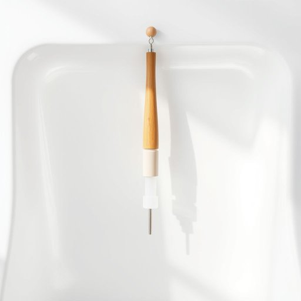

# baster

<h1 style="font-size: 2.5em; font-weight: 300; letter-spacing: 2px; margin: 0; color: #2c3e50;">
/baster*/
</h1>

---

---

## 例句

Before we start cooking, could you hand me the baster hanging next to the sink with the red handle so I can keep the roast juicy and flavorful?

*Before(/ˌbiˈfɔr/) we(/wi/) start(/stɑrt/) cooking,(/ˈkʊkɪŋ,/) could(/kʊd/) you(/ju/) hand(/hænd/) me(/mi/) the(/ðə/) baster(/baster*/) hanging(/ˈhæŋɪŋ/) next(/nɛkst/) to(/tɪ/) the(/ðə/) sink(/sɪŋk/) with(/wɪθ/) the(/ðə/) red(/rɛd/) handle(/ˈhændəl/) so(/soʊ/) I(/aɪ/) can(/kən/) keep(/kip/) the(/ðə/) roast(/roʊst/) juicy(/ˈʤusi/) and(/ənd/) flavorful?(/ˈfleɪvərfəl?/)*

**翻译：** 在开始烹饪之前，你能帮我拿一下挂在水槽旁那个红色手柄的注油器吗？这样我才能保持烤肉的多汁和美味。

---

## 解释

英语单词“baster”作为名词，在家居生活用品的语境中指的是一种烹饪工具，通常是用来给烤肉或烤禽类食物表面浇汁、汁液或油脂，以保持食物湿润和增加风味的设备。具体使用场合多见于烤箱烹调过程中，如烤火鸡、烤鸡或烤肉时，用海绵头或喷嘴设计的baster将汁液吸取并均匀地涂抹到食物表面。英语学习者需要注意的是，baster作为可数名词，通常与动词如“use”、“employ”或短语“a turkey baster”等搭配使用，此外，“baste”作为动词则指“涂汁、浇汁”的动作；因此二者在句中不能混淆。词源方面，“baster”来源于动词“baste”的派生名词形式，“baste”本身源自中古法语“baster”，意为缝合时的临时缝线，后来引申到烹饪中“涂抹”的动作，体现了工具辅助完成该动作的功能。在中文语境中，“baster”通常被翻译为“烤肉用注油器”或“烤肉刷”，有时也称作“烤肉滴汁器”，准确传达其功能特点。该词在使用时基本无褒贬色彩，属于中性词汇，文化内涵与欧美家庭侧重于烤制食物风味及食材湿润度的烹饪习惯相关，是西方烹饪器具中的常见用品。

---

<small style="color: #999; font-size: 0.9em;">2025-07-17 06:22:39</small>

