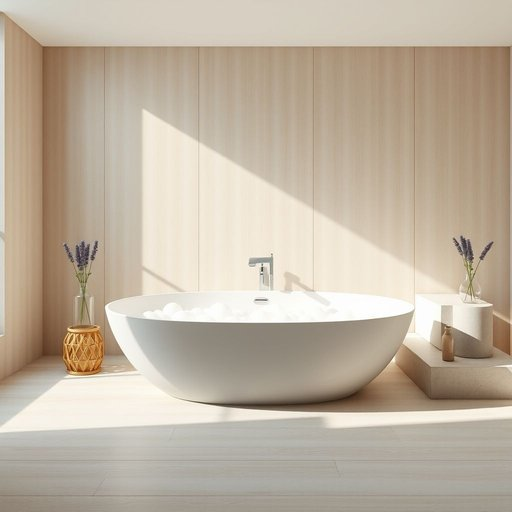

# bath

<h1 style="font-size: 2.5em; font-weight: 300; letter-spacing: 2px; margin: 0; color: #2c3e50;">
/bæθ/
</h1>

---

---

## 例句

After a long day of work, she decided to draw a hot bath filled with lavender-scented bubbles, which not only helped her relax but also softened her tired muscles, making the evening feel much more tranquil and luxurious.

*After(/ˈæftər/) a(/ə/) long(/lɔŋ/) day(/deɪ/) of(/əv/) work,(/wərk,/) she(/ʃi/) decided(/ˌdɪˈsaɪdɪd/) to(/tɪ/) draw(/drɔ/) a(/ə/) hot(/hɑt/) bath(/bæθ/) filled(/fɪld/) with(/wɪθ/) lavender-scented(/lavender-scented*/) bubbles,(/ˈbəbəlz,/) which(/wɪʧ/) not(/nɑt/) only(/ˈoʊnli/) helped(/hɛlpt/) her(/hər/) relax(/rɪˈlæks/) but(/bət/) also(/ˈɔlsoʊ/) softened(/ˈsɔfənd/) her(/hər/) tired(/taɪərd/) muscles,(/ˈməsəlz,/) making(/ˈmeɪkɪŋ/) the(/ðə/) evening(/ˈivnɪŋ/) feel(/fil/) much(/məʧ/) more(/mɔr/) tranquil(/ˈtræŋkwɪl/) and(/ənd/) luxurious.(/ləgˈʒəriəs./)*

**翻译：** 经过一整天的劳累，她决定放满薰衣草香泡泡的热水澡，这不仅帮助她放松身心，还舒缓了疲惫的肌肉，使得这个夜晚更加宁静而奢华。

---

## 解释

英语单词“bath”作为名词在家居生活用品的语境中，主要指“浴缸”或“洗澡的容器”，即用来盛水供人洗澡的设备。具体使用场合多见于家庭卫生间、酒店客房描述或家庭装修相关话题。例如，谈及洗澡设施时，可以说“I took a bath”表示“我泡了个澡”，或“The bathroom has a large bath”意为“浴室里有一个大浴缸”。英语学习者需要注意的是，bath作为名词通常不可数，但也可以指“泡澡一次”，意义上可用作可数名词，如“take a bath”或“have a bath”，表达“洗澡”这件事情。在搭配上，常见短语有“bath tub”（浴缸，带有强调单词形式），“bath water”（浴缸里的水），“bubble bath”（泡泡浴，指加了泡沫剂的洗澡水），及“bath towel”（浴巾）等，其中“bath”本身并不表示水或毛巾，但在复合词或短语里可以扩展意义。语法上，bath与动词take连用构成固定搭配，表示“洗澡”，需要记住其用法区别于“shower”（淋浴）。词源方面，bath源自古英语“bæth”，进一步可追溯到古高地德语及古诺尔斯语中的类似形式，根源与“浸泡”或“沐浴”相关，体现了人类早期卫生习惯的历史延续。在中文语境中，“bath”准确对应“浴缸”或“洗澡”，且带有较强的生活化和日常使用色彩。需要注意，“bath”本身无褒贬色彩，但在英国英语中，“bath”多指浸泡式洗澡，与淋浴区分，体现了文化和生活方式的差异，因此对非英语母语者理解时应结合具体场景，避免混淆。总之，“bath”作为名词在家居生活中是指供人洗澡的设施或相关概念，既有具体物件含义，也可引申为洗澡的动作或过程，是日常生活中常用且基础的词汇。

---

<small style="color: #999; font-size: 0.9em;">2025-07-17 06:22:39</small>

