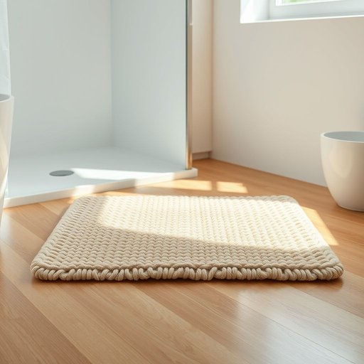

# bathmat

<h1 style="font-size: 2.5em; font-weight: 300; letter-spacing: 2px; margin: 0; color: #2c3e50;">
/bathmat*/
</h1>

---

---

## 例句

Before stepping out of the shower, make sure you lay the bathmat neatly on the floor, as it not only prevents slipping but also soaks up excess water, keeping the bathroom tidy and reducing the risk of dampness that could damage the wooden flooring beneath.

*Before(/ˌbiˈfɔr/) stepping(/ˈstɛpɪŋ/) out(/aʊt/) of(/əv/) the(/ðə/) shower,(/ʃaʊər,/) make(/meɪk/) sure(/ʃʊr/) you(/ju/) lay(/leɪ/) the(/ðə/) bathmat(/bathmat*/) neatly(/ˈnitli/) on(/ɔn/) the(/ðə/) floor,(/flɔr,/) as(/ɛz/) it(/ɪt/) not(/nɑt/) only(/ˈoʊnli/) prevents(/prɪˈvɛnts/) slipping(/sˈlɪpɪŋ/) but(/bət/) also(/ˈɔlsoʊ/) soaks(/soʊks/) up(/əp/) excess(/ˈɛkˌsɛs/) water,(/ˈwɔtər,/) keeping(/ˈkipɪŋ/) the(/ðə/) bathroom(/ˈbæθˌrum/) tidy(/ˈtaɪdi/) and(/ənd/) reducing(/rɪˈdusɪŋ/) the(/ðə/) risk(/rɪsk/) of(/əv/) dampness(/ˈdæmpnɪs/) that(/ðət/) could(/kʊd/) damage(/ˈdæmɪʤ/) the(/ðə/) wooden(/ˈwʊdən/) flooring(/ˈflɔrɪŋ/) beneath.(/bɪˈniθ./)*

**翻译：** 在走出淋浴前，请确保将浴室地垫整齐地铺放在地板上，这不仅能防止滑倒，还能吸收多余的水分，保持浴室整洁，减少可能损坏木地板的潮湿风险。

---

## 解释

英语单词bathmat作为名词，指的是放置在浴室或洗澡区域地面上的垫子，主要功能是防滑和吸水，帮助人们在洗澡后擦干脚部并避免滑倒，常见于家居生活用品的语境中。使用时，bathmat通常搭配动词如place（放置）、use（使用）、buy（购买）等，如Please put the bathmat in front of the shower（请把浴室垫放在淋浴前），它属于可数名词，单复数形式分别为bathmat和bathmats。英语学习者需注意bathmat为合成名词，由bath（浴、洗澡）和mat（垫子）组成，词义比较直白且没有复杂的变形规则，常见表达包括non-slip bathmat（防滑浴室垫）、memory foam bathmat（记忆泡沫浴室垫）等，能够准确描述不同材质和功能的产品。词源上，bathmat在20世纪左右出现，反映了现代家庭浴室用品的细分和功能需求，起源于bath与mat的直接结合，便于指代专门用于洗澡环境的垫子。在中文语境中，bathmat通常翻译为浴室垫或浴室防滑垫，理解时应强调其使用场合即浴室，功能多为防滑和吸水，区别于普通地毯或门垫。该词语本身无褒贬含义及特殊文化色彩，属于中性家居用品词汇，适用于日常生活描述及相关产品购买、使用等场景。

---

<small style="color: #999; font-size: 0.9em;">2025-07-17 06:22:39</small>

