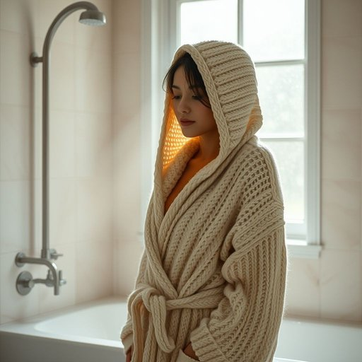

# bathrobe

<h1 style="font-size: 2.5em; font-weight: 300; letter-spacing: 2px; margin: 0; color: #2c3e50;">
/ˈbæθˌroʊb/
</h1>

---

---

## 例句

After stepping out of the steamy bathroom, she wrapped herself tightly in the soft, hooded bathrobe that her grandmother had knitted years ago, appreciating not only its warmth but also the nostalgic comfort it brought on those chilly, rainy mornings spent by the window.

*After(/ˈæftər/) stepping(/ˈstɛpɪŋ/) out(/aʊt/) of(/əv/) the(/ðə/) steamy(/ˈstimi/) bathroom,(/ˈbæθˌrum,/) she(/ʃi/) wrapped(/ræpt/) herself(/hərˈsɛlf/) tightly(/ˈtaɪtli/) in(/ɪn/) the(/ðə/) soft,(/sɔft,/) hooded(/ˈhʊdɪd/) bathrobe(/ˈbæθˌroʊb/) that(/ðət/) her(/hər/) grandmother(/ˈgrændˌməðər/) had(/hæd/) knitted(/ˈnɪtɪd/) years(/jɪrz/) ago,(/əˈgoʊ,/) appreciating(/əˈpriʃiˌeɪtɪŋ/) not(/nɑt/) only(/ˈoʊnli/) its(/ɪts/) warmth(/wɔrmθ/) but(/bət/) also(/ˈɔlsoʊ/) the(/ðə/) nostalgic(/nɔˈstælʤɪk/) comfort(/ˈkəmfərt/) it(/ɪt/) brought(/brɔt/) on(/ɔn/) those(/ðoʊz/) chilly,(/ˈʧɪli,/) rainy(/ˈreɪni/) mornings(/ˈmɔrnɪŋz/) spent(/spɛnt/) by(/baɪ/) the(/ðə/) window.(/ˈwɪndoʊ./)*

**翻译：** 走出蒸汽弥漫的浴室后，她紧紧裹住那件多年前祖母亲手织就的柔软连帽浴袍，不仅感受到它的温暖，更珍惜那些在窗边度过的阴冷雨晨中带来的那份怀旧慰藉。

---

## 解释

英语单词“bathrobe”作为名词，指的是一种在家居生活中常见的宽松长袍，通常在洗澡后穿着，用以保暖和覆盖身体，常见材质有棉、绒毛或丝绸，适合浴后或起居时穿着，使用场合多为浴室、卧室或休息区，体现舒适和放松的氛围。英语学习者使用“bathrobe”时需注意其为可数名词，复数形式为“bathrobes”，常见搭配包括“put on a bathrobe”（穿上浴袍）、“wear a bathrobe”（穿着浴袍）和“a fluffy bathrobe”（柔软的浴袍），表达时可用来形容舒适或休闲状态；需避免与“robe”或“dressing gown”混淆，后者在英式英语中含义接近，但“bathrobe”更强调浴后使用。词源上，“bathrobe”由“bath”（浴）和“robe”（长袍）组成，19世纪开始在英语中广泛使用，用于具体指浴后穿着的衣物，体现其功能性。中文语境中，“bathrobe”通常准确翻译为“浴袍”或“浴衣”，指的是专门用于浴后披穿的长袍，强调其家居和洗浴后保暖的作用，无特殊褒贬色彩，属于日常实用的生活用品词汇，文化内涵上体现西方居家生活中的舒适习惯和注重个人卫生后休息的生活细节。

---

<small style="color: #999; font-size: 0.9em;">2025-07-17 06:22:39</small>

