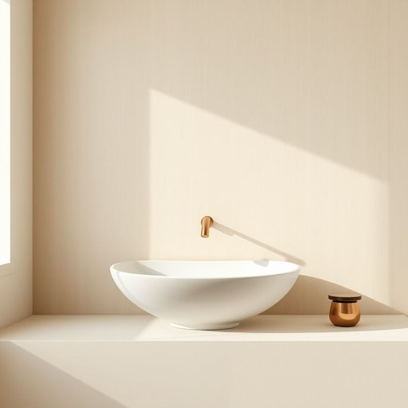

# bathroomware

<h1 style="font-size: 2.5em; font-weight: 300; letter-spacing: 2px; margin: 0; color: #2c3e50;">
/bathroomware*/
</h1>

---

---

## 例句

When the bathroomware in the old Victorian house was restored meticulously by skilled artisans, it not only preserved the historical authenticity but also integrated modern functionality, thereby creating a unique blend of vintage charm and contemporary convenience that impressed every discerning visitor.

*When(/wɪn/) the(/ðə/) bathroomware(/bathroomware*/) in(/ɪn/) the(/ðə/) old(/oʊld/) Victorian(/vɪkˈtɔriən/) house(/haʊs/) was(/wɑz/) restored(/rɪˈstɔrd/) meticulously(/məˈtɪkjələsli/) by(/baɪ/) skilled(/skɪld/) artisans,(/ˈɑrtəzənz,/) it(/ɪt/) not(/nɑt/) only(/ˈoʊnli/) preserved(/prɪˈzərvd/) the(/ðə/) historical(/hɪˈstɔrɪkəl/) authenticity(/ˌɔθənˈtɪsɪti/) but(/bət/) also(/ˈɔlsoʊ/) integrated(/ˈɪnəˌgreɪtɪd/) modern(/ˈmɑdərn/) functionality,(/ˌfəŋkʃəˈnælɪti,/) thereby(/ˈðɛrˈbaɪ/) creating(/kriˈeɪtɪŋ/) a(/ə/) unique(/juˈnik/) blend(/blɛnd/) of(/əv/) vintage(/ˈvɪntɪʤ/) charm(/ʧɑrm/) and(/ənd/) contemporary(/kənˈtɛmpərˌɛri/) convenience(/kənˈvinjəns/) that(/ðət/) impressed(/ˌɪmˈprɛst/) every(/ˈɛvəri/) discerning(/dɪˈsərnɪŋ/) visitor.(/ˈvɪzɪtər./)*

**翻译：** 当技艺精湛的工匠细心修复这栋维多利亚时代老宅的卫浴设施时，不仅保存了其历史的真实性，还融合了现代的功能性，因而创造出复古韵味与当代便利的独特结合，让每一位挑剔的访客都为之惊叹。

---

## 解释

bathroomware作为名词，指的是浴室用品或卫浴器具，通常涵盖洗手盆、马桶、浴缸、水龙头、淋浴设备等安装于浴室内的各种器械和配件。在家居生活用品的英语语境中，该词多用于装修、建筑、家居设计或卫浴产品销售领域，描述与浴室功能相关的硬件设备，常见句子如“The store specializes in high-quality bathroomware”即“这家商店专营高品质的浴室器具”。英语学习者使用时应注意bathroomware通常作为不可数名词出现，若需表达复数意义，常用bathroom fittings、fixtures或bathroom products等短语替代，且多以整体设备群体的形式出现，少用复数形式bathroomwares，因为ware本身多为集合名词。此外，它常与形容词搭配，如modern bathroomware（现代浴室用品）、ceramic bathroomware（陶瓷卫浴器具）。词源上，bathroomware由bathroom（浴室）和ware（器具、用品）复合构成，ware源自古英语waru，意指物品或商品，现代用法延伸为特定类别的器具。中文语境中，bathroomware准确翻译为“浴室器具”或“卫浴用品”，强调用于提升浴室功能性的硬件设施，与日常洗浴用品（如毛巾、香皂等洗护用品）区分开来。该词无特殊褒贬含义或文化色彩，属于中性专业词汇，适合正式语境使用，尤其在建筑设计、家居陈设等领域频繁出现，有助于准确表达浴室相关硬件设备的整体概念。

---

<small style="color: #999; font-size: 0.9em;">2025-07-17 06:22:39</small>

