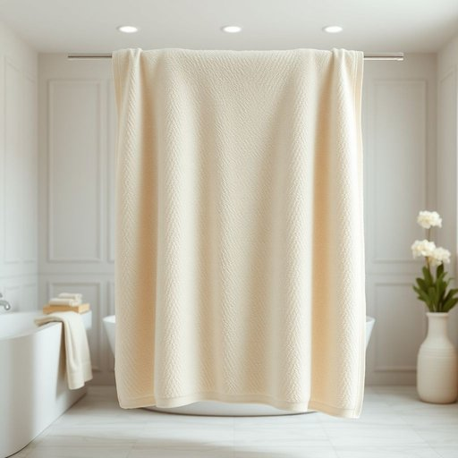

# bathsheet

<h1 style="font-size: 2.5em; font-weight: 300; letter-spacing: 2px; margin: 0; color: #2c3e50;">
/bathsheet*/
</h1>

---

---

## 例句

After I stepped out of the shower, I reached for the large, fluffy bathsheet—the one we bought last summer during the holiday sale—which not only dried me off quickly but also made wrapping myself up feel like a cosy, indulgent ritual at the end of a long day.

*After(/ˈæftər/) I(/aɪ/) stepped(/stɛpt/) out(/aʊt/) of(/əv/) the(/ðə/) shower,(/ʃaʊər,/) I(/aɪ/) reached(/riʧt/) for(/fər/) the(/ðə/) large,(/lɑrʤ,/) fluffy(/ˈfləfi/) bathsheet—the(/bathsheet—the*/) one(/wən/) we(/wi/) bought(/bɔt/) last(/læst/) summer(/ˈsəmər/) during(/ˈdʊrɪŋ/) the(/ðə/) holiday(/ˈhɑlɪˌdeɪ/) sale—which(/sale—which*/) not(/nɑt/) only(/ˈoʊnli/) dried(/draɪd/) me(/mi/) off(/ɔf/) quickly(/kˈwɪkli/) but(/bət/) also(/ˈɔlsoʊ/) made(/meɪd/) wrapping(/ˈræpɪŋ/) myself(/ˌmaɪˈsɛlf/) up(/əp/) feel(/fil/) like(/laɪk/) a(/ə/) cosy,(/ˈkoʊzi,/) indulgent(/ˌɪnˈdəlʤənt/) ritual(/ˈrɪʧuəl/) at(/æt/) the(/ðə/) end(/ɛnd/) of(/əv/) a(/ə/) long(/lɔŋ/) day.(/deɪ./)*

**翻译：** 洗完澡后，我伸手拿起那条大而柔软的浴巾——就是我们去年夏天假期促销时买的那条——它不仅能迅速擦干身体，还能让我在一天劳累之后，将自己裹得如同沉浸在一场温馨而惬意的仪式中。

---

## 解释

bathsheet在家居生活用品领域作为名词，指的是一种比普通浴巾尺寸更大、面积更宽阔的浴巾，通常用于沐浴后包裹身体或擦干大量水分，适合需要更大覆盖面积的人使用，常见于家庭浴室、酒店或SPA场所。使用时，英语学习者应注意bathsheet为可数名词，复数形式为bathsheet或bathsheets，常见搭配包括“large bathsheet”（大号浴巾）、“cotton bathsheet”（棉质浴巾）和“soft bathsheet”（柔软浴巾）等，表达时需注意其作为具体物品时不可随意省略定冠词或数量词。此外，bathsheet不同于普通bath towel，强调尺寸更大更宽敞，这是理解和使用时的重点。词源上，bathsheet由“bath”（洗澡）和“sheet”（大片布料）组成，sheet本身意指大幅布料，结合后特指用于洗澡的大型毛巾，其起源反映了英语中以功能和形态直接命名生活用品的习惯。在中文语境中，bathsheet准确翻译为“大浴巾”或“特大号浴巾”，区别于一般的“浴巾”，强调尺寸和使用的舒适度，没有明显褒贬色彩，属于中性描述词汇，通常表示更加舒适和高档的生活体验，符合现代家居用品追求实用与舒适的文化需求。

---

<small style="color: #999; font-size: 0.9em;">2025-07-17 06:22:39</small>

