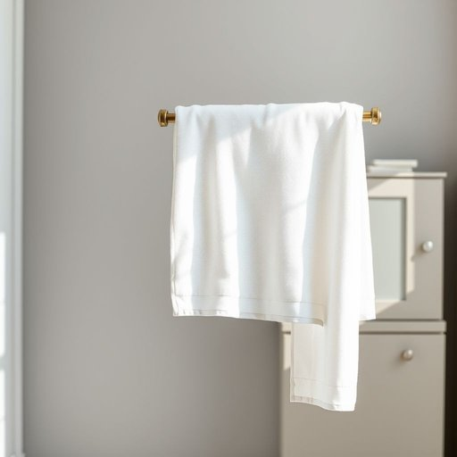

# bathtowel

<h1 style="font-size: 2.5em; font-weight: 300; letter-spacing: 2px; margin: 0; color: #2c3e50;">
/bathtowel*/
</h1>

---

---

## 例句

After your shower, the bathtowel that you need to grab from the linen cupboard downstairs is the clean one, because the fluffy white bathtowel you used yesterday, which is still hanging on the rail to dry, will not be ready until this evening.

*After(/ˈæftər/) your(/jʊr/) shower,(/ʃaʊər,/) the(/ðə/) bathtowel(/bathtowel*/) that(/ðət/) you(/ju/) need(/nid/) to(/tɪ/) grab(/græb/) from(/frəm/) the(/ðə/) linen(/ˈlɪnən/) cupboard(/ˈkəbərd/) downstairs(/ˈdaʊnˈstɛrz/) is(/ɪz/) the(/ðə/) clean(/klin/) one,(/wən,/) because(/bɪˈkəz/) the(/ðə/) fluffy(/ˈfləfi/) white(/waɪt/) bathtowel(/bathtowel*/) you(/ju/) used(/juzd/) yesterday,(/ˈjɛstərˌdeɪ,/) which(/wɪʧ/) is(/ɪz/) still(/stɪl/) hanging(/ˈhæŋɪŋ/) on(/ɔn/) the(/ðə/) rail(/reɪl/) to(/tɪ/) dry,(/draɪ,/) will(/wɪl/) not(/nɑt/) be(/bi/) ready(/ˈrɛdi/) until(/ənˈtɪl/) this(/ðɪs/) evening.(/ˈivnɪŋ./)*

**翻译：** 洗澡后，你需要从楼下的亚麻布橱柜里拿干净的浴巾，因为你昨天用过的那条蓬松洁白的浴巾还挂在晾衣架上晾干，要到今晚才会干。

---

## 解释

英语单词“bathtowel”作为名词，指的是一种用于擦干身体的较大毛巾，通常在洗澡或沐浴后使用，主要出现在家居生活用品的语境中，比如浴室、卧室或泳池旁。学习者在使用时应注意“bathtowel”为可数名词，复数形式是“bathtowels”，常见搭配包括“dry oneself with a bathtowel”（用浴巾擦干身体）、“hang the bathtowel”（挂浴巾）等。此外，该词由“bath”（浴）和“towel”（毛巾）组合而成，词源直白且易于理解，没有复杂的历史演变，体现了物品的功能性和使用场景。在中文中，“bathtowel”准确翻译为“浴巾”，是指专门用于沐浴后擦拭身体的大毛巾，区别于通常尺寸较小的“毛巾”或“手巾”。该词汇本身无特殊褒贬含义或文化色彩，属于日常生活中常见且中性词汇，使用时应根据具体情境正确区分“bath towel”（浴巾）与普通“towel”（毛巾），避免混淆不同类型的毛巾。

---

<small style="color: #999; font-size: 0.9em;">2025-07-17 06:22:39</small>

