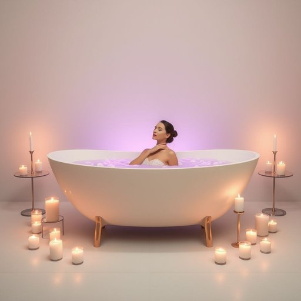

# bathtub

<h1 style="font-size: 2.5em; font-weight: 300; letter-spacing: 2px; margin: 0; color: #2c3e50;">
/ˈbæθtəb/
</h1>

---

---

## 例句

After a long day at work, she sank into the warm bathtub, which was filled with lavender-scented bubbles and surrounded by flickering candles, hoping the relaxing atmosphere would ease the tension built up in her shoulders and clear her mind before bedtime.

*After(/ˈæftər/) a(/ə/) long(/lɔŋ/) day(/deɪ/) at(/æt/) work,(/wərk,/) she(/ʃi/) sank(/sæŋk/) into(/ˈɪntu/) the(/ðə/) warm(/wɔrm/) bathtub,(/ˈbæθtəb,/) which(/wɪʧ/) was(/wɑz/) filled(/fɪld/) with(/wɪθ/) lavender-scented(/lavender-scented*/) bubbles(/ˈbəbəlz/) and(/ənd/) surrounded(/sərˈaʊndɪd/) by(/baɪ/) flickering(/ˈflɪkərɪŋ/) candles,(/ˈkændəlz,/) hoping(/ˈhoʊpɪŋ/) the(/ðə/) relaxing(/rɪˈlæksɪŋ/) atmosphere(/ˈætməsˌfɪr/) would(/wʊd/) ease(/iz/) the(/ðə/) tension(/ˈtɛnʃən/) built(/bɪlt/) up(/əp/) in(/ɪn/) her(/hər/) shoulders(/ˈʃoʊldərz/) and(/ənd/) clear(/klɪr/) her(/hər/) mind(/maɪnd/) before(/ˌbiˈfɔr/) bedtime.(/ˈbɛdˌtaɪm./)*

**翻译：** 经过一天的辛劳，她沉入温暖的浴缸，浴缸中充满了薰衣草香气的泡沫，周围点缀着摇曳的蜡烛，希望这宁静的氛围能缓解肩上的紧张，让思绪在入睡前变得清明。

---

## 解释

英语单词"bathtub"作为名词，指的是家居中用于洗浴的容器，通常指固定在浴室内的长方形或椭圆形水槽，供人装水泡澡使用。具体使用场合多见于讨论家居装修、浴室设施、洗浴用品或生活习惯时，例如“I took a long soak in the bathtub”（我在浴缸里泡了很久）。英语学习者在使用"bathtub"时需注意它是可数名词，通常前面可加冠词the或a，常见搭配有“take a bath in the bathtub”（在浴缸洗澡）、“fill the bathtub with hot water”（往浴缸里放热水）等；"bathtub"本身不可直接用作动词，但可与动词搭配形成表达，如“fill”，“drain”等。词源上，"bathtub"由"bath"（洗澡）和"tub"（桶、槽）复合而成，19世纪中后期随着现代浴室设备普及起源于英美，形象地描述了用于洗澡的“桶式”容器。该词在中文环境中准确翻译为“浴缸”，是指家用洗浴设备，语义中性，无贬褒含义或特殊文化色彩，仅用于描述一种生活必备卫生设施。在中文语境下，“浴缸”强调其功能和形态，使用时也多涉及卫生、舒适及居家环境等相关话题。

---

<small style="color: #999; font-size: 0.9em;">2025-07-17 06:22:39</small>

