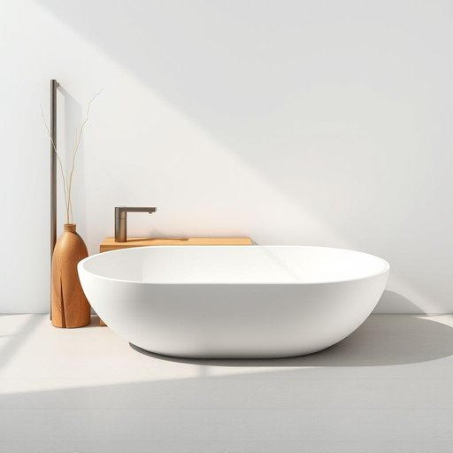

# bathware

<h1 style="font-size: 2.5em; font-weight: 300; letter-spacing: 2px; margin: 0; color: #2c3e50;">
/bathware*/
</h1>

---

---

## 例句

During the conference, the keynote speaker emphasized the importance of innovation as the driving force behind sustainable economic growth, highlighting how advancements in technology and creative problem-solving can transform industries and improve global living standards.

*During(/ˈdʊrɪŋ/) the(/ðə/) conference,(/ˈkɑnfərəns,/) the(/ðə/) keynote(/ˈkiˌnoʊt/) speaker(/ˈspikər/) emphasized(/ˈɛmfəˌsaɪzd/) the(/ðə/) importance(/ˌɪmˈpɔrtəns/) of(/əv/) innovation(/ˌɪnəˈveɪʃən/) as(/ɛz/) the(/ðə/) driving(/ˈdraɪvɪŋ/) force(/fɔrs/) behind(/bɪˈhaɪnd/) sustainable(/səˈsteɪnəbəl/) economic(/ˌɛkəˈnɑmɪk/) growth,(/groʊθ,/) highlighting(/ˈhaɪˌlaɪtɪŋ/) how(/haʊ/) advancements(/ədˈvænsmənts/) in(/ɪn/) technology(/tɛkˈnɑləʤi/) and(/ənd/) creative(/kriˈeɪtɪv/) problem-solving(/problem-solving*/) can(/kən/) transform(/ˈtrænsfɔrm/) industries(/ˈɪndəstriz/) and(/ənd/) improve(/ˌɪmˈpruv/) global(/ˈgloʊbəl/) living(/ˈlɪvɪŋ/) standards.(/ˈstændərdz./)*

**翻译：** 在会议期间，主旨演讲者强调了创新作为可持续经济增长驱动力的重要性，着重指出科技进步和创造性解决问题的能力如何改变行业格局并提升全球生活水平。

---

## 解释

英语单词“bathware”作为名词，主要指浴室用具或浴室相关的器具，如洗脸盆、浴缸、水龙头、花洒等日常生活中安装或使用的卫浴设备，常见于家居装修、卫浴产品销售、建筑设计等语境中。学习者在使用时需注意该词通常作为不可数名词，表示一类产品或集合概念，常见搭配有“bathware products”（浴室用品）、“bathware collection”（浴室用具系列）等，表达时多用于复数整体或抽象名词形式，较少单独指单一具体物件。词源上，“bathware”由“bath”（洗澡）和“ware”（器具、用品）组合而成，后者源自古英语“waru”，意指商品或器具，结合体现了与洗浴相关的用具或商品的含义。在中文语境中，准确翻译为“卫浴用具”或“浴室器具”，涵盖各种浴缸、洗手盆、龙头等产品，强调功能性和使用环境。该词语义中性，无褒贬含义，也无特殊文化色彩，主要是一种专业或商业领域的术语，用于描述浴室装修和用品类别。

---

<small style="color: #999; font-size: 0.9em;">2025-07-17 06:22:39</small>

