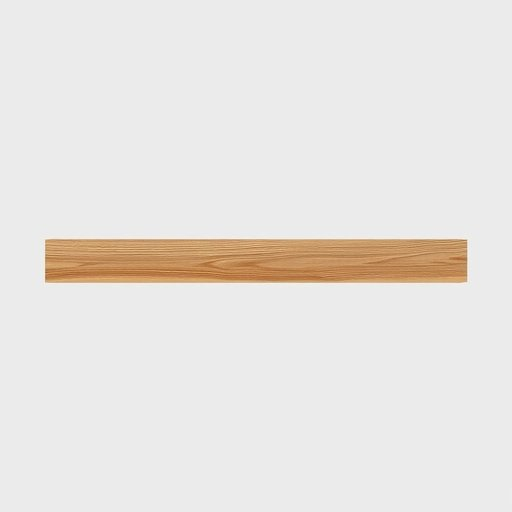

# beam

<h1 style="font-size: 2.5em; font-weight: 300; letter-spacing: 2px; margin: 0; color: #2c3e50;">
/bim/
</h1>

---

---

## 例句

The old oak beam, which stretched across the ceiling of the living room and bore the weight of the entire upper floor, had been carefully sanded and varnished to preserve its rustic charm while blending seamlessly with the modern décor.

*The(/ðə/) old(/oʊld/) oak(/oʊk/) beam,(/bim,/) which(/wɪʧ/) stretched(/strɛʧt/) across(/əˈkrɔs/) the(/ðə/) ceiling(/ˈsilɪŋ/) of(/əv/) the(/ðə/) living(/ˈlɪvɪŋ/) room(/rum/) and(/ənd/) bore(/bɔr/) the(/ðə/) weight(/weɪt/) of(/əv/) the(/ðə/) entire(/ɪnˈtaɪər/) upper(/ˈəpər/) floor,(/flɔr,/) had(/hæd/) been(/bɪn/) carefully(/ˈkɛrfəli/) sanded(/ˈsændɪd/) and(/ənd/) varnished(/ˈvɑrnɪʃt/) to(/tɪ/) preserve(/prɪˈzərv/) its(/ɪts/) rustic(/ˈrəstɪk/) charm(/ʧɑrm/) while(/waɪl/) blending(/ˈblɛndɪŋ/) seamlessly(/ˈsimləsli/) with(/wɪθ/) the(/ðə/) modern(/ˈmɑdərn/) décor.(/décor*./)*

**翻译：** 那根横跨客厅天花板、承载着整个上层楼重量的老橡木横梁，经过细心打磨和上漆，既保留了其质朴的魅力，又与现代装饰完美融合。

---

## 解释

在家居生活用品的语境中，英语单词“beam”作为名词主要指建筑结构中的“横梁”或“梁”，即承重的木制或金属制构件，常见于房屋的天花板、屋顶或楼板下，用于支撑上部结构的重量。具体使用场合多见于描述房屋结构、装修设计、家具制作等，例如“The ceiling has exposed wooden beams”（天花板有裸露的木梁）。英语学习者在使用“beam”时，应注意其不可数和可数的区别：作为结构部件时，“beam”一般可数，如a beam, two beams；此外，“beam”也可用于光线的“一束”，但此时语境不同，需根据语境判断。常见搭配有“wooden beam”（木梁）、“steel beam”（钢梁）、“supporting beam”（承重梁）等，表达时需明确材料和功能；在语法上，“beam”作为名词常与形容词连用修饰，且多用于具体物理实体。词源上，“beam”源自古英语“beam”，意指树干或木头，最初指生长中的树木，后来引申为建筑中的木质横梁，体现了形态与功能的转变。该词无明显褒贬色彩，属于中性建筑用语。在中文语境中，“beam”翻译为“梁”时，强调其结构性和承重功能，应区别于抽象的“光束”或“波束”，避免混淆。整体而言，“beam”作为家居生活用品中的名词，准确理解为建筑构件中的“梁”是其核心意义，通常涉及房屋稳定性和安全性，学者在使用时应结合具体情境和专业属性进行恰当表达。

---

<small style="color: #999; font-size: 0.9em;">2025-07-17 06:22:39</small>

