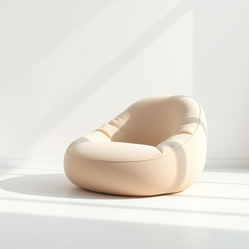

# beanbag

<h1 style="font-size: 2.5em; font-weight: 300; letter-spacing: 2px; margin: 0; color: #2c3e50;">
/beanbag*/
</h1>

---

---

## 例句

The complexity of the project, which was exacerbated by unforeseen technical challenges, demanded a level of expertise and dedication that few team members possessed.

*The(/ðə/) complexity(/kəmˈplɛksɪti/) of(/əv/) the(/ðə/) project,(/ˈprɑʤɛkt,/) which(/wɪʧ/) was(/wɑz/) exacerbated(/ɪgˈzæsərˌbeɪtɪd/) by(/baɪ/) unforeseen(/ˌənfɔrˈsin/) technical(/ˈtɛknɪkəl/) challenges,(/ˈʧælənʤɪz,/) demanded(/dɪˈmændɪd/) a(/ə/) level(/ˈlɛvəl/) of(/əv/) expertise(/ˌɛkspərˈtiz/) and(/ənd/) dedication(/ˌdɛdəˈkeɪʃən/) that(/ðət/) few(/fju/) team(/tim/) members(/ˈmɛmbərz/) possessed.(/pəˈzɛst./)*

**翻译：** 项目的复杂性因突如其来的技术难题而加剧，这要求具备少数团队成员所拥有的专业技能和专注投入。

---

## 解释

beanbag作为名词在家居生活用品的语境中通常指一种由柔软布料制成内部填充小颗粒如豆子泡沫球等的坐垫或小垫子常用于休闲坐具如豆袋椅或豆包坐垫适合放置在客厅儿童房或休闲区提供轻便舒适的坐感英语学习者在使用beanbag时应注意它通常是可数名词复数形式为beanbags并且常与表示位置on the beanbag颜色或用途的形容词连用如a large beanbag a red beanbag chair此外beanbag本身可作为复合名词直接用作名词不作动词使用这个词来源于bean豆子和bag袋子的组合最初指内装干豆或类似小颗粒的袋子后来演变为装填合适颗粒用于坐具的袋子起源于20世纪中期的休闲家具设计中文语境中beanbag通常准确翻译为豆袋椅或豆包椅强调其填充物质和柔软形态避免误解为普通枕头或靠垫在文化内涵上beanbag椅多与轻松休闲现代家居风格相关通常并无贬义但在正式场合或严肃环境中使用可能显得过于随意总体来看该词在家居生活中指一种设计便捷适合家庭休闲使用的舒适坐具

---

<small style="color: #999; font-size: 0.9em;">2025-07-17 06:22:39</small>

