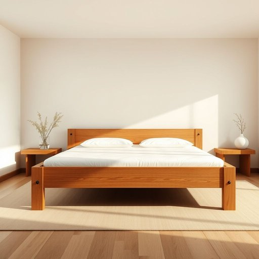

# bed-frame

<h1 style="font-size: 2.5em; font-weight: 300; letter-spacing: 2px; margin: 0; color: #2c3e50;">
/bed-frame*/
</h1>

---

---

## 例句

After weeks of discomfort caused by the mattress, our conversation finally turned to the necessity of replacing the bed-frame, which despite its sturdy oak construction, had developed loose joints that disrupted our sleep with persistent creaking.

*After(/ˈæftər/) weeks(/wiks/) of(/əv/) discomfort(/dɪˈskəmfərt/) caused(/kɔzd/) by(/baɪ/) the(/ðə/) mattress,(/ˈmætrəs,/) our(/ɑr/) conversation(/ˌkɑnvərˈseɪʃən/) finally(/ˈfaɪnəli/) turned(/tərnd/) to(/tɪ/) the(/ðə/) necessity(/nəˈsɛsɪti/) of(/əv/) replacing(/rɪˈpleɪsɪŋ/) the(/ðə/) bed-frame,(/bed-frame*,/) which(/wɪʧ/) despite(/dɪˈspaɪt/) its(/ɪts/) sturdy(/ˈstərdi/) oak(/oʊk/) construction,(/kənˈstrəkʃən,/) had(/hæd/) developed(/dɪˈvɛləpt/) loose(/lus/) joints(/ʤɔɪnts/) that(/ðət/) disrupted(/dɪsˈrəptɪd/) our(/ɑr/) sleep(/slip/) with(/wɪθ/) persistent(/pərˈsɪstənt/) creaking.(/ˈkrikɪŋ./)*

**翻译：** 经过数周被床垫带来的不适之后，我们的谈话终于转向了更换床架的必要性。尽管这张床架采用结实的橡木制作，但其接头已松动，持续的嘎吱声打扰了我们的睡眠。

---

## 解释

bed-frame作为名词，指的是床架，即支撑床垫的框架结构，通常由金属或木材制成，用于固定床垫的位置并提供整体床的支撑。在家居生活用品的语境中，bed-frame常见于家具购买、卧室布置或室内装修等场合，涉及到床的组成部分说明或家具配置建议。英语学习者在使用bed-frame时应注意它是复合名词，多用于单数和复数形式bed-frames，且通常用于具体可数名词语境中，如a sturdy bed-frame或wooden bed-frames，搭配常见形容词有metal、wooden、sturdy、simple等，表达技巧上可结合床垫（mattress）、床头板（headboard）等词语进行描述以增强语义。bed-frame一词源自bed（床）和frame（框架），frame本意为框架结构，这种组成体现了其功能属性，即提供床铺的支撑与形状固定，属于英语中大量由名词组合而成的合成名词，反映了日常物件命名的直观规律。在中文语境中，bed-frame准确翻译为床架或床架子，强调的是床体的骨架部分，与床垫和床板相区分，没有褒贬色彩，也无特殊文化内涵，属中性词汇，主要用于说明家具构造或购买时的具体配置描述，因此理解时应聚焦于其物理组成和功能属性。

---

<small style="color: #999; font-size: 0.9em;">2025-07-17 06:22:39</small>

