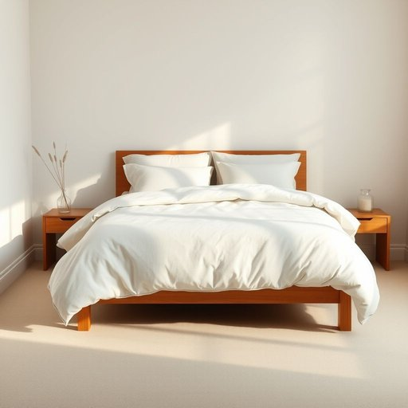

# bed-linen

<h1 style="font-size: 2.5em; font-weight: 300; letter-spacing: 2px; margin: 0; color: #2c3e50;">
/bed-linen*/
</h1>

---

---

## 例句

Before guests arrive this weekend, I need to wash and iron the bed-linen, make sure the duvet covers are fresh, and replace any pillowcases that have worn out, so that the spare bedroom feels inviting and comfortable.

*Before(/ˌbiˈfɔr/) guests(/gɛsts/) arrive(/əraɪv/) this(/ðɪs/) weekend,(/ˈwiˌkɪnd,/) I(/aɪ/) need(/nid/) to(/tɪ/) wash(/wɑʃ/) and(/ənd/) iron(/aɪərn/) the(/ðə/) bed-linen,(/bed-linen*,/) make(/meɪk/) sure(/ʃʊr/) the(/ðə/) duvet(/duvet*/) covers(/ˈkəvərz/) are(/ər/) fresh,(/frɛʃ,/) and(/ənd/) replace(/ˌriˈpleɪs/) any(/ˈɛni/) pillowcases(/pillowcases*/) that(/ðət/) have(/hæv/) worn(/wɔrn/) out,(/aʊt,/) so(/soʊ/) that(/ðət/) the(/ðə/) spare(/spɛr/) bedroom(/ˈbɛˌdrum/) feels(/filz/) inviting(/ˌɪnˈvaɪtɪŋ/) and(/ənd/) comfortable.(/ˈkəmfərtəbəl./)*

**翻译：** 在客人本周末到来之前，我需要洗熨床上用品，确保被套干净清爽，并更换任何已经磨损的枕套，以使客卧温馨舒适，令人感到欢迎。

---

## 解释

“bed-linen”作为名词，指的是床上用品中的织物部分，主要包括床单、被罩、枕套等，用于覆盖床垫和被褥，提供舒适和卫生的睡眠环境。这个词常见于涉及家居生活用品、卧室布置或者旅馆客房描述等场合，语境多为购买建议、清洁护理或装饰搭配讨论。英语学习者在使用“bed-linen”时需注意其复数形式通常为“bed-linen”或“bed-linens”，但更常见的是以复数名词“bed sheets”、“bed covers”等具体名称表达，因为“linen”本身是不可数名词，表示亚麻布料或床品总称，故“bed-linen”作为复合名词时应整体看待且一般不用加复数s。此外，常见搭配包括“一套床品”（set of bed-linen）、“更换床单”（change bed-linen）、“床品面料”（bed-linen fabric）等，表达时习惯使用“bed-linen”前加具体形容词如“棉质床品”（cotton bed-linen），以明确材质。词源上，“bed”来源于古英语“bedd”，意为睡觉用的床或地方，“linen”则源自拉丁语“linum”，意指亚麻布，传统上床单多用亚麻制成，故“bed-linen”合成词体现了专用于床的亚麻织物。中文语境中“bed-linen”应准确翻译为“床上用品”或“床单被罩”，强调的是纺织品部分而非床垫或家具，避免与“床垫”混淆。该词语无特殊褒贬或文化内涵，属于中性词汇，多用于日常生活或零售领域，体现整洁与舒适的生活品质。综上，“bed-linen”是描述家居生活中床上纺织用品时的专业术语，使用时注意语法习惯以及具体搭配，有助于表达准确、地道。

---

<small style="color: #999; font-size: 0.9em;">2025-07-17 06:22:39</small>

