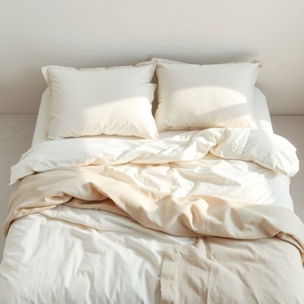

# bedding

<h1 style="font-size: 2.5em; font-weight: 300; letter-spacing: 2px; margin: 0; color: #2c3e50;">
/ˈbɛdɪŋ/
</h1>

---

---

## 例句

Before we start decorating the guest room, could you please check if the bedding, including the duvet covers, pillowcases, and sheets, has been washed recently, because I want to ensure everything is fresh and comfortable for our visitors?

*Before(/ˌbiˈfɔr/) we(/wi/) start(/stɑrt/) decorating(/ˈdɛkərˌeɪtɪŋ/) the(/ðə/) guest(/gɛst/) room,(/rum,/) could(/kʊd/) you(/ju/) please(/pliz/) check(/ʧɛk/) if(/ɪf/) the(/ðə/) bedding,(/ˈbɛdɪŋ,/) including(/ˌɪnˈkludɪŋ/) the(/ðə/) duvet(/duvet*/) covers,(/ˈkəvərz,/) pillowcases,(/pillowcases*,/) and(/ənd/) sheets,(/ʃits,/) has(/həz/) been(/bɪn/) washed(/wɑʃt/) recently,(/ˈrisəntli,/) because(/bɪˈkəz/) I(/aɪ/) want(/wɔnt/) to(/tɪ/) ensure(/ɪnˈʃʊr/) everything(/ˈɛvriˌθɪŋ/) is(/ɪz/) fresh(/frɛʃ/) and(/ənd/) comfortable(/ˈkəmfərtəbəl/) for(/fər/) our(/ɑr/) visitors?(/ˈvɪzɪtərz?/)*

**翻译：** 在我们开始布置客房之前，能否请您确认一下床上用品，包括被套、枕套和床单，最近是否已经清洗过？我希望为来访的客人确保一切都干净舒适。

---

## 解释

英语单词bedding作为名词在家居生活用品的语境中，主要指用于床上的各种织物材料，如床单、被套、枕套、毯子及床垫保护罩等，统称为床上用品或床罩类用品。具体使用场合常见于购物、家居布置或酒店服务中，比如change the bedding（更换床上用品）或bedroom bedding sets（卧室床上用品套装）。英语学习者需要注意bedding通常是不可数名词，用作整体概念时不加复数形式，若强调多种具体用品时，有时也用bedding items或具体名词细分；此外，bedding不能直接作为被子或床单的单独代称，需要结合上下文理解。常见搭配有bedding set（床上用品套装）、bedding materials（寝具材料）、bedding department（寝具部门）等。该词源自古英语bedd意指睡觉的地方，后衍生出指铺在床上的用具，体现其与睡眠环境紧密关联的起源背景。在中文语境中，bedding通常准确翻译为床上用品或床罩用品，涵盖范围较广，不单指被子或床单，理解时需结合实际语境，避免狭义化。此词在使用中无明显褒贬色彩或特殊文化内涵，属于中性词汇，表达功能主要是描述家庭生活中基本的睡眠用布用品。

---

<small style="color: #999; font-size: 0.9em;">2025-07-17 06:22:39</small>

