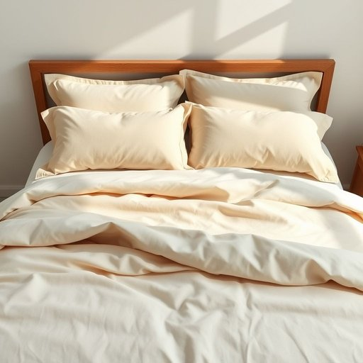

# bedlinen

<h1 style="font-size: 2.5em; font-weight: 300; letter-spacing: 2px; margin: 0; color: #2c3e50;">
/bedlinen*/
</h1>

---

---

## 例句

Before we start the house guests arriving this weekend, could you please check if the bedlinen in the guest room, including the pillowcases and duvet covers, has been freshly washed and ironed, just to ensure they have the utmost comfort during their stay?

*Before(/ˌbiˈfɔr/) we(/wi/) start(/stɑrt/) the(/ðə/) house(/haʊs/) guests(/gɛsts/) arriving(/ərˈaɪvɪŋ/) this(/ðɪs/) weekend,(/ˈwiˌkɪnd,/) could(/kʊd/) you(/ju/) please(/pliz/) check(/ʧɛk/) if(/ɪf/) the(/ðə/) bedlinen(/bedlinen*/) in(/ɪn/) the(/ðə/) guest(/gɛst/) room,(/rum,/) including(/ˌɪnˈkludɪŋ/) the(/ðə/) pillowcases(/pillowcases*/) and(/ənd/) duvet(/duvet*/) covers,(/ˈkəvərz,/) has(/həz/) been(/bɪn/) freshly(/ˈfrɛʃli/) washed(/wɑʃt/) and(/ənd/) ironed,(/aɪərnd,/) just(/ʤɪst/) to(/tɪ/) ensure(/ɪnˈʃʊr/) they(/ðeɪ/) have(/hæv/) the(/ðə/) utmost(/ˈətˌmoʊst/) comfort(/ˈkəmfərt/) during(/ˈdʊrɪŋ/) their(/ðɛr/) stay?(/steɪ?/)*

**翻译：** 在我们迎接本周末的来访客人之前，能否请您确认一下客房的床上用品，包括枕套和被套，是否已经清洗干净并熨烫平整，以确保他们在入住期间享有最佳的舒适感？

---

## 解释

英语单词bedlinen作为名词，主要指床上用的织物，包括床单、被套和枕套等，通常用于描述家居生活中的卧室用品。在具体使用场合和语境中，bedlinen多见于购物、家居布置、酒店服务及家政行业，表达床上用品的整体集合或某种材质、款式的床单被套组合。英语学习者在使用该词时应注意它是一个不可数名词，常用的搭配有bedlinen set（床上用品套装）、wash the bedlinen（洗床单被套），以及形容词修饰，如cotton bedlinen（棉质床单）等。此外，bedlinen常与bed sheets（床单）以及bedclothes（床上用品）区分，bedlinen范围较广。该词的词源来自bed（床）和linen（亚麻布，泛指织物）组合而成，体现了早期床上用品多采用亚麻布制作的历史背景。中文语境中，bedlinen通常译为床上用品或床单被套，强调的是整个床上织物的总称，准确理解应包括被单、床单和枕套等，而非单一的床单。此词无特殊褒贬色彩，属于标准中性词汇，在日常生活和商务语境中均可使用。

---

<small style="color: #999; font-size: 0.9em;">2025-07-17 06:22:39</small>

